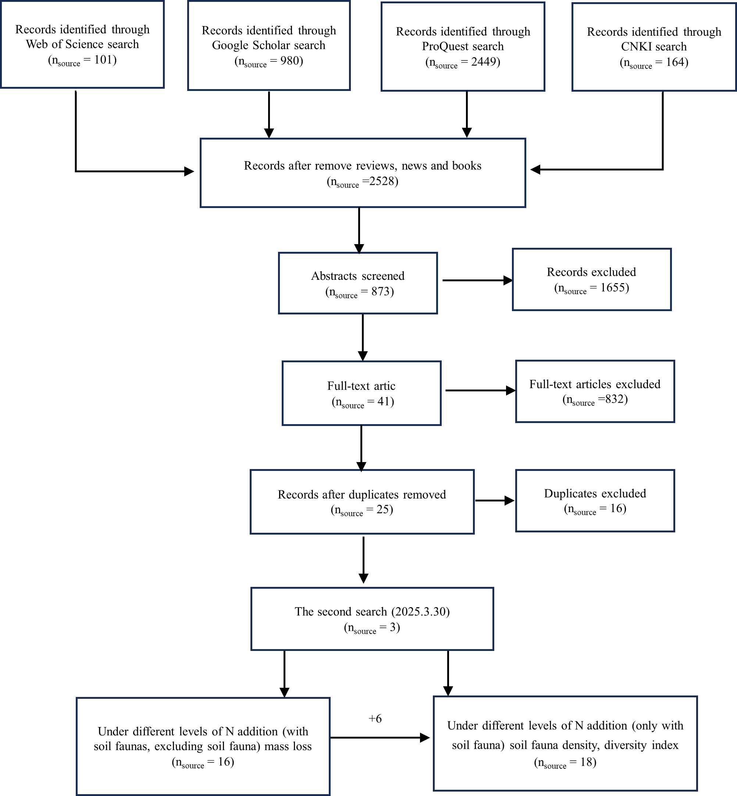

```{r setup, include=FALSE}
knitr::opts_chunk$set(echo = TRUE,cache = TRUE, message=FALSE, warning=FALSE)
```


# Introduction 

Anthropogenic N deposition critically alters terrestrial ecosystem stability and biogeochemical cycles by disrupting core ecosystem processes, such as litter decomposition. But divergent findings persist regarding the effects of soil fauna in mediating litter decomposition under N enrichment due to variations in N addition rates, N addition forms, litter type (single litter vs. litter mixture), and decomposition duration. We extract the massloss,soil fauna density,soil fauna diversity,N addition rates,N addition forms,litter type (single litter vs. litter mixture), and decomposition time from previous studies aims to integrate up to date global observations on soil fauna’s role as litter decomposers under N addition.
We carried out a metaanalysis to find out globally how does N deposition affect litter and soil fauna abundance and diversity.

We used the following search terms: ("nitrogen deposition" OR "nitrogen addition") AND
("litter decomposition" OR "mixed litter decomposition" OR "litter leaf
decomposition" OR decay* OR degrade*) AND (affects OR response) AND
(litterbag* OR "mesh size" OR "soil fauna*"). In July 2024, we made two different
searches in the China National Knowledge Infrastructure (CNKI) database separately
using the equivalent in Chinese of the following search terms ("nitrogen addition"
AND litter AND "soil fauna") and ("nitrogen deposition" AND litter AND "soil
fauna"), yielding 117 and 47 publications, respectively.

At the end of the search, we have a file data sources from .

Figure S1 PRISMA flow chart showing the procedure of selecting publications.


## Load important packages

First we need to load the most needed libraries.

```{r}
library(meta)
library(metafor)
library(ggplot2)
library(DT)
library(dplyr)
library(data.table)
library(tidyverse)
library(patchwork)
```

# Import the experiment data file
After data expraction and compilation, we merge all data into the file named "N addition.csv".

```{r}
dt<- read.csv("N addition.csv", header = TRUE, sep = ",", quote = "\"",
              dec = ".", fill = TRUE, comment.char = "",fileEncoding = 'latin1')
```

## Data cleaning and rearrangement

### Nitrogen addition levels

We initially planned to classify nitrogen addition levels into three categories (low, moderate and high). However, following avalaible data and to make sure there is no disparity in ranges within each level, we ended up by classifying this into five levels.

```{r}
str(dt)
summary(dt$N_addition_levels_kg_per_ha_per_yr)
breaks <- c(-Inf,0,50,100, 150,Inf)
labels <- c("0","1~50","51~100","101~150", ">150")
dt$N_level <- cut(dt$N_addition_levels_kg_per_ha_per_yr, breaks = breaks, labels = labels, right = TRUE)
dt$N_level=as.factor(dt$N_level)
breaks <- c(-Inf, 0, Inf)

labels <- c("0",">0")
dt$addition <- cut(dt$N_addition_levels_kg_per_ha_per_yr, breaks = breaks, labels = labels, right = TRUE)
dt$addition=as.factor(dt$addition)
```

### classify the soil.fauna

We need to classify based on mesh size whether litterbags allow soil fauna entrance or not. 
When mesh size is 0 then soil fauna is considered absent and otherwise soil fauna is present.

```{r}
dt$mesh_size=as.numeric(dt$mesh_size)
breaks <- c( 0, 1, Inf)
labels <- c("Fauna absent","Fauna present")
dt$soil.fauna1<- cut(dt$mesh_size, breaks = breaks, labels = labels, right =TRUE )

dt$soil.fauna1=as.character(dt$soil.fauna1)
dt$soil.fauna <- ifelse(!is.na(dt$soil.fauna1), dt$soil.fauna1, dt$soil_fauna2)
dt$soil.fauna=as.factor(dt$soil.fauna)
```

### classify the decomposition_time_days

```{r}
dt$decomposition_time_days=as.numeric(dt$decomposition_time_days)
summary(dt$decomposition_time_days)
# The median of the decomposition duration acros our database is 240 days, thus we use this as a cut off 
breaks <- c(0,240,Inf)
labels <- c("≤240",">240")
dt$decomposition.time.level<- cut(dt$decomposition_time_days, breaks = breaks, labels = labels, right =TRUE )
dt$decomposition.time.level=as.factor(dt$decomposition.time.level)
```

### Extract the climate factors
We use coordinates of study site to extract the annual precipitation and mean annual temperature from WORLDCLIM.

```{r}
dt1 <- dt[complete.cases(dt[, c("longitude_W", "latitude_N")]), ]
#View(dt1)
t<- dt1 %>%
  dplyr::select(site,longitude_W,latitude_N)
t <- t[!duplicated(t$site), ]
library(geodata)
library(raster)
library(sp)
library(dismo)
clim_data <- worldclim_global(var = "bio", res = 10,path = tempdir())
print(clim_data)
coordinates(t) <- ~longitude_W+latitude_N
coords <- coordinates(t)  # to retrieve coordinate
colnames(coords) <- c("longitude_W", "latitude_N")  # name columns names as coordinates

# Retrieve climatic data based on coordinates provided
clim_values <- terra::extract(clim_data, coords)

# Combine coordinates and climatic values 
result <- cbind(coords, clim_values)
#print(result)
```

### Classify precipitation
We then classify mean annual precipitation into factor with the cut off threshold being the median.

```{r}
dt$precipitation_mm=as.numeric(dt$precipitation_mm)
summary(dt$precipitation_mm)
breaks <- c( 0,1125,Inf)
labels <- c("≤1125",">1125")
dt$precipitation.level<- cut(dt$precipitation_mm, breaks = breaks, labels = labels, right =TRUE )
dt$precipitation.level=as.factor(dt$precipitation.level)
```

### Classify temperature
We then classify mean annual temperature into factor with the cut off threshold being the median.

```{r}
dt$temperature_C=as.numeric(dt$temperature_C)
summary(dt$temperature_C)
breaks <- c( 0,15,Inf)
labels <- c("≤15",">15")
dt$temperature.level<- cut(dt$temperature_C, breaks = breaks, labels = labels, right =TRUE )
dt$temperature.level=as.factor(dt$temperature.level)
```

## Study sites distribution map
We construct the study sites distribution map using inbuilt functions in R. First plot the world map and latter plot the coordinates of the study sites on top of it by differenciating by colors.


```{r}
world_map <- map_data("world")

library(ggplot2)
p <- ggplot() + coord_fixed() + xlab("") + ylab("")

base_worldm <- p + geom_polygon(data=world_map, aes(x=long, y=lat, group=group),colour="gray90", fill="gray90")
base_worldm

cleanup <-
  theme(panel.grid.major = element_blank(), panel.grid.minor = element_blank(),
        panel.background = element_rect(fill = 'white', colour = 'white'),
        axis.line = element_line(colour = "white"), legend.position="none",
        axis.ticks=element_blank(), axis.text.x=element_blank(),
        axis.text.y=element_blank())
base_world <- base_worldm + cleanup
base_world

unique(dt$site)

library(plyr) 
ds <- ddply(dt, c("Type","site","longitude_W","latitude_N"), summarise,
            N= length(mass_loss))

p<- base_world +
  geom_point(data=ds,  aes(x=longitude_W, y=latitude_N,colour=Type),
             size=1.5, alpha=I(0.5)) +
  theme(legend.position="bottom", legend.box = "vertical") +
  labs(colour="Type",size=5)+
  theme(legend.background = element_rect(fill = "white"),
        legend.key = element_rect(fill = "white", color = NA))+
  guides(color=guide_legend(title.hjust=0.2))+
  theme(legend.title = element_text(face = "bold",size = 8))+ theme(legend.text=element_text(size=8))
p

ggsave(filename="Figure 1 Geographical_distribution of study sites.png", plot=p, device="png",
        height=5, width=7, units="in", dpi=500)

```

# Data analysis 

## Experiment A (presents soil fauna absent as control)
This dataset category has soil fauna absent as control and soil fauna present as treatment.

```{r}
A=dt[dt$Type=="A",]
faunaabsent=A[A$soil.fauna=="Fauna absent",]
faunapresent=A[A$soil.fauna=="Fauna present",]
library(dplyr)
faunaabsent_selected <- faunaabsent %>%
  dplyr::select(N_addition_levels_kg_per_ha_per_yr, decomposition_time_days, litter_type,numbers,latitude_N,mass_loss,Mse,Mn)
dat <- merge(faunapresent,faunaabsent_selected, by = c("N_addition_levels_kg_per_ha_per_yr", "decomposition_time_days", "litter_type", "numbers","latitude_N"), all = TRUE)
dat <- dat %>%
  relocate(1:3, .after = 17)
dat <- dat %>%
  relocate(7, .after = 2)
dat <- dat %>%
  relocate(14,.after = 17)
dat <- dat %>%
  dplyr::select(-20:-25,)
dat <- dat %>%
  dplyr::select(-13,-22,)
dat <- dat %>%
  relocate(16:18,.after = 24)
#View(dat)
```

### Change "se" to "sd"
We need standard deviation for subsequent analysis thus we convert now standard error to standard deviation.

```{r}
dat$Msd.x=dat$Mse.x*sqrt(dat$Mn.x)
dat$Msd.y=dat$Mse.y*sqrt(dat$Mn.y)
```

### Conversion variables to factors
We need to convert N addition type and litter type to factors.

```{r}
str(dat)
dat$N_addition_type=as.factor(dat$N_addition_type)
dat$Litter.type=dat$litter_type
```

### Computations of effect size for category A dataset

We then compute the log response ratio effect size with the function *escal* from the metafor package.

```{r}
str(dat)
dat$mass_loss.x=as.numeric(dat$mass_loss.x)
dat$mass_loss.y=as.numeric(dat$mass_loss.y)
dat_R=escalc(measure = "ROM", 
           m1i =mass_loss.x , m2i = mass_loss.y, 
           sd1i =Msd.x, sd2i =Msd.y, 
           n1i =Mn.x, n2i =Mn.y, 
           data = dat)
#View(dat_R)
```

### Addition id of each study to the dataset

We add id of each study to the dataset.

```{r}
dat_R$numbers=as.character(dat_R$numbers)
dat_R$numbers=as.numeric(dat_R$numbers)
library(dplyr)
dat_R <- dat_R %>% arrange(numbers)
dat_R$id <- 1:nrow(dat_R)
```

### Cummulative effect value

We then establish a nested model to calculate the cumulative effect value.

```{r}
random_m <- rma.mv(yi = yi,V=vi,random=list(~1|numbers/id),method = "ML",data =dat_R)
summary(random_m)

percentage_change <- (exp(0.1414) - 1) * 100
percentage_change
```

Based on the overall effect size, we can say that `r round(percentage_change, 3)`% change in the decomposition in the presence soil fauna regardless of the level of nitrogen addition. 

### Display of the effect value on a figure
We use ggplot function from ggplot 2 package to display the effect size value.

```{r}
theme_custom <- function(){
  theme(
    panel.background = element_rect(fill = 'white', color = 'black', size = 0.5),
    panel.grid = element_blank(),
    legend.position = 'none',
    plot.margin = margin(6, 6, 6, 8),
    plot.background = element_blank(),
    axis.ticks = element_line(size = 0.3),
    axis.ticks.length = unit(-0.15, 'lines')
  )
}

CMYKtoRGB <- function(C, M, Y, K){
  R <- as.character(as.hexmode(ceiling((1 - C) * (1 - K) * 255)))
  G <- as.character(as.hexmode(ceiling((1 - M) * (1 - K) * 255)))
  B <- as.character(as.hexmode(ceiling((1 - Y) * (1 - K) * 255)))
  if (nchar(R) == 1) R <- paste0('0', R)
  if (nchar(G) == 1) G <- paste0('0', G)
  if (nchar(B) == 1) B <- paste0('0', B)
  paste0('#', R, G, B)
}

dat_R1 <- dat_R[, c('yi', 'vi')]
dat_R1 <- dat_R1[order(dat_R1$yi), ]
dat_R1$SD <- sqrt(dat_R1$vi)
figData <- data.frame(
  Sample = seq(1, nrow(dat_R1)),
  Mean = dat_R1$yi,
  SD = dat_R1$SD
)

figData$Color <- CMYKtoRGB(0.4, 0, 0.4, 0.1)  

overall_effect <- data.frame(
  Mean = 0.1425,
  lower = 0.0323,
  upper =0.2528 ,
  Sample = 0  
)

q1=ggplot(figData) +
  geom_errorbar(
    aes(x = Sample, ymin = Mean - qnorm(0.975) * SD, ymax = Mean + qnorm(0.975) * SD),
    color = figData$Color, size = 0.1, width = 0
  ) +
  geom_point(
    aes(x = Sample, y = Mean),
    color = figData$Color, size = 0.5
  ) +
  geom_pointrange(
    data = overall_effect,
    aes(x = Sample, y = Mean, ymin = lower, ymax = upper),
    color = CMYKtoRGB(0, 0.6, 1, 0), 
    size = 0.8,                          
    fatten = 2.5,                           
    shape = 18,                           
    fill = CMYKtoRGB(0, 0.6, 1, 0))+
  annotate("text", x = 1.5, y =1.5,  
           label = "K=213", 
           size = 2.5, color = "black",fontface = "italic" ) +
  annotate("text", x = -1.5, y =-1.5,  
           label = "Overall", 
           size = 2.5, color = "black",fontface = "italic" )+
  geom_hline(yintercept = 0, linetype = 'dashed', color = '#000000', size = 0.2) +
  scale_y_continuous(limits = c(-2, 2), expand = c(0, 0)) +labs(title = "a")+
  coord_flip() +
  theme_custom() +
  theme(text = element_text(size = 10,face="bold"),
    axis.ticks.y = element_blank(),
    axis.text.y = element_blank()
  ) +
  labs(y = "Effect size (lnRR)", x = "")
q1
```

### Compute effect values at different N addition levels

```{r}
N_add.0<- rma.mv(yi,V=vi, data =dat_R,random=list(~1|numbers/id),method = "ML",subset = (N_level=="0"))
N_add.l<- rma.mv(yi,V=vi, data =dat_R,random=list(~1|numbers/id),method = "ML",subset = (N_level=="1~50"))
N_add.ll<- rma.mv(yi,V=vi, data =dat_R,random=list(~1|numbers/id),method = "ML",subset = (N_level=="51~100"))
N_add.mm<- rma.mv(yi,V=vi, data =dat_R,random=list(~1|numbers/id),method = "ML",subset = (N_level=="101~150"))
N_add.h<- rma.mv(yi,V=vi, data =dat_R,random=list(~1|numbers/id),method = "ML",subset = (N_level==">150"))
N_add.1<- rma.mv(yi,V=vi, data =dat_R,random=list(~1|numbers/id),method = "ML",subset = (addition==">0"))
N_add.0
N_add.l
N_add.ll
N_add.mm
N_add.h
N_add.1
length(which(dat_R$N_level==">150"))
```

### The influence of different N addition levels on the effect value (Figure)

```{r}
sl <- data.frame(
  labels=c("0 (68)","Overall(>0) (145)", "1~50 (60)", "51~100 (35)", '101~150 (36)', ">150 (14)"),
  point_est=c(0.1621, 0.1372,0.1284,0.2112,0.2462,0.0623),
  lb_ci = c(0.0471,0.0334,-0.0250,0.0669,0.1040,0.0354),
  ub_ci = c(0.2771,0.2410,0.2818,0.3555,0.3885,0.0892),
  group = c(1,2,3,4,5,6))

sl$label <- factor(sl$label, levels = sl$label)
R1 <- ggplot(sl, aes(x=point_est, y=label))  +
  geom_point(size=3) + scale_y_discrete(limits = rev(levels(sl$label)))+xlim(-0.4,0.4)+geom_vline(xintercept=0, color="black", linetype="dashed", alpha=.5) +
  geom_errorbarh(aes(xmin=lb_ci, xmax=ub_ci), height=.2) + theme(legend.position="none") +
  ylab("N addition level") + xlab("Effect size (ln(RR))") +labs(title = "a")+ 
  theme(text = element_text(size =10,face="bold"), panel.background = element_blank(),
        panel.grid.major = element_blank(), 
        panel.grid.minor = element_blank(),
        axis.line = element_line(colour = "black"),
        panel.border = element_rect(colour = "black", fill=NA, size=1.5)) + 
  theme(axis.text = element_text(family = "palatino", colour = "black", size = (8)))
R1
```

#### Effects of precipitation, temperature and litter type across N addition

Extract different N levels respectively to understand the influence of rainfall, temperature, types of litter and decomposition time on the effect value at different N levels.

```{r}
dat_R=as.data.frame(dat_R)
dat_R$litter_type=dat_R$Litter.type
N_add.0<- dat_R[dat_R$N_level=="0",]
N_add.l<-dat_R[dat_R$N_level=="1~50",]
N_add.ll<-dat_R[dat_R$N_level=="51~100",] 
N_add.mm<-dat_R[dat_R$N_level=="101~150",] 
N_add.h<-dat_R[dat_R$N_level==">150",]
N_add.1<-dat_R[dat_R$addition==">0",]

#####N_add.0
rlp1 <- rma.mv(yi = yi, V = vi,random=list(~1|numbers/id),method = "ML", data =N_add.0 )
summary(rlp1)
#####N_add.l
rlp2 <- rma.mv(yi = yi, V = vi,random=list(~1|numbers/id),method = "ML", data =N_add.l )
summary(rlp2)
#####N_add.m
rlp3 <- rma.mv(yi = yi, V = vi,random=list(~1|numbers/id),method = "ML", data =N_add.ll )
summary(rlp3)
#####N_add.mm
rlp4 <- rma.mv(yi = yi, V = vi,random=list(~1|numbers/id),method = "ML", data =N_add.mm )
summary(rlp4)
#####N_add.h
rlp5 <- rma.mv(yi = yi, V = vi,random=list(~1|numbers/id),method = "ML", data =N_add.h )
summary(rlp5)
nrow(N_add.ll)
#####N_add.1
rlp6 <- rma.mv(yi = yi, V = vi,random=list(~1|numbers/id),method = "ML", data =N_add.1 )
summary(rlp6)
nrow(N_add.1)
```

#### Effect of different decomposition duration across N addition

Different decomposition times at different N levels.

```{r}
N_add.0_short<- rma.mv(yi,V=vi, data =N_add.0,random=list(~1|numbers/id),method = "ML",subset = (decomposition.time.level=="≤240"))
summary(N_add.0_short)
N_add.0_long<- rma.mv(yi,V=vi, data =N_add.0,random=list(~1|numbers/id),method = "ML",subset = (decomposition.time.level==">240"))
summary(N_add.0_long)
N_add.1_short<- rma.mv(yi,V=vi, data =N_add.1,random=list(~1|numbers/id),method = "ML",subset = (decomposition.time.level=="≤240"))
summary(N_add.1_short)
N_add.1_long<- rma.mv(yi,V=vi, data =N_add.1,random=list(~1|numbers/id),method = "ML",subset = (decomposition.time.level==">240"))
summary(N_add.1_long)
N_add.l_short<- rma.mv(yi,V=vi, data =N_add.l,random=list(~1|numbers/id),method = "ML",subset = (decomposition.time.level=="≤240"))
summary(N_add.l_short)
N_add.l_long<- rma.mv(yi,V=vi, data =N_add.l,random=list(~1|numbers/id),method = "ML",subset = (decomposition.time.level==">240"))
summary(N_add.l_long)
N_add.ll_short<- rma.mv(yi,V=vi, data =N_add.ll,random=list(~1|numbers/id),method = "ML",subset = (decomposition.time.level=="≤240"))
summary(N_add.ll_short)
N_add.ll_long<- rma.mv(yi,V=vi, data =N_add.ll,random=list(~1|numbers/id),method = "ML",subset = (decomposition.time.level==">240"))
summary(N_add.ll_long)
N_add.mm_short<- rma.mv(yi,V=vi, data =N_add.mm,random=list(~1|numbers/id),method = "ML",subset = (decomposition.time.level=="≤240"))
summary(N_add.mm_short)
N_add.mm_long<- rma.mv(yi,V=vi, data =N_add.mm,random=list(~1|numbers/id),method = "ML",subset = (decomposition.time.level==">240"))
summary(N_add.mm_long)
N_add.h_short<- rma.mv(yi,V=vi, data =N_add.h,random=list(~1|numbers/id),method = "ML",subset = (decomposition.time.level=="≤240"))
summary(N_add.h_short)
N_add.h_long<- rma.mv(yi,V=vi, data =N_add.h,random=list(~1|numbers/id),method = "ML",subset = (decomposition.time.level==">240"))
summary(N_add.h_long)
```


#### Plot the influence of different decomposition times on nitrogen addition

Here we are plotting effect values N addition levels across different decomposition times.

```{r}
sl <- data.frame(
  labels=c("0 (68)", "Incubation time ≤240 (40)","Incubation time >240 (28)","Overall(>0) (145)", "Incubation time ≤240 (72)","Incubation time >240 (73)","1~50 (60)",
           "Incubation time ≤240 (31)","Incubation time >240 (29)","51~100 (35)","Incubation time ≤240 (15)","Incubation time >240 (20)",
           '101~150 (36)',"Incubation time ≤240 (20)","Incubation time >240 (16)",">150 (14)","Incubation time ≤240 (6)","Incubation time >240 (8)"),
  point_est=c(0.1621,0.2296,0.1294,0.1372,0.2006,0.1375,0.1284,0.1898,0.1431,0.2112,0.2833,0.2079,0.2462,0.2677,0.2508,0.0623,0.1542,0.0510),
  lb_ci = c(0.0471,0.1400,-0.0271,0.0334,0.1104,-0.0139,-0.0250,0.0837,-0.0607,0.0669,0.0886,0.0448,0.1040,0.1123,0.0649,0.0354,0.0277,0.0178),
  ub_ci = c(0.2771,0.3192,0.2859,0.2410,0.2909,0.2889,0.2818,0.2959,0.3469,0.3555,0.4781,0.3711,0.3885,0.4232,0.4368,0.0892,0.2808,0.0841),
  group = c(1,2,3,4,5,6,7,8,9,10,11,12,13,14,15,16,17,18))

sl$new_group <- ifelse(sl$group %in% c(1,4,7,10,13,16), "Group 1",
                       ifelse(sl$group %in% c(2,3,5,6,8,9,11,12,14,15,17,18), "Group 2",
                              NA))

sl$newgroup <- ifelse(sl$group %in% c(2,5,8,11,14,17), "Group 1",
                      ifelse(sl$group %in% c(3,6,9,12,15,18), "Group 2",
                             ifelse(sl$group %in% c(1,4,7,10,13,16), "Group 3",
                                    NA)))
sl$label <- factor(sl$label, levels = sl$label)
R2<- ggplot(sl, aes(x=point_est, y=label,shape=newgroup,color=new_group))  +
  geom_point(size=2) + scale_y_discrete(limits = rev(levels(sl$label)))+xlim(-0.5,0.5)+geom_vline(xintercept=0, color="black", linetype="dashed", alpha=.5) +
  geom_errorbarh(aes(xmin=lb_ci, xmax=ub_ci), height=.2) + theme(legend.position="none") +
  ylab("N addition level and Incubation time") + xlab("Effect size (ln(RR))") +labs(title = "b")+
  scale_color_manual(values = c("#F6944B", "#E995C9"))+
  scale_shape_manual(values = c(15,17,16))+
  geom_hline(yintercept=15.5, color="black", linetype="dashed", alpha=.5)+
  geom_hline(yintercept=12.5, color="black", linetype="dashed", alpha=.5)+
  geom_hline(yintercept=9.5, color="black", linetype="dashed", alpha=.5)+
  geom_hline(yintercept=6.5, color="black", linetype="dashed", alpha=.5)+
  geom_hline(yintercept=3.5, color="black", linetype="dashed", alpha=.5)+
  theme(text = element_text(size = 10,face="bold"), panel.background = element_blank(),
        panel.grid.major = element_blank(), 
        panel.grid.minor = element_blank(),
        axis.line = element_line(colour = "black"),
        panel.border = element_rect(colour = "black", fill=NA, size=1.5)) + 
  theme(axis.text = element_text(family = "palatino", colour = "black", size = (8)))

R2
```


#### Effects of different precipitation of different N addition levels

```{r}
N_add.0_low<- rma.mv(yi,V=vi, data =N_add.0,random=list(~1|numbers/id),method = "REML",subset = (precipitation.level=="≤1125"))
summary(N_add.0_low)
N_add.0_high<- rma.mv(yi,V=vi, data =N_add.0,random=list(~1|numbers/id),method = "REML",subset = (precipitation.level==">1125"))
summary(N_add.0_high)
N_add.1_low<- rma.mv(yi,V=vi, data =N_add.1,random=list(~1|numbers/id),method = "REML",subset = (precipitation.level=="≤1125"))
summary(N_add.1_low)
N_add.1_high<- rma.mv(yi,V=vi, data =N_add.1,random=list(~1|numbers/id),method = "REML",subset = (precipitation.level==">1125"))
summary(N_add.1_high)
N_add.l_low<- rma.mv(yi,V=vi, data =N_add.l,random=list(~1|numbers/id),method = "REML",subset = (precipitation.level=="≤1125"))
summary(N_add.l_low)
N_add.l_high<- rma.mv(yi,V=vi, data =N_add.l,random=list(~1|numbers/id),method = "REML",subset = (precipitation.level==">1125"))
summary(N_add.l_high)
N_add.ll_low<- rma.mv(yi,V=vi, data =N_add.ll,random=list(~1|numbers/id),method = "REML",subset = (precipitation.level=="≤1125"))
summary(N_add.ll_low)
N_add.ll_high<- rma.mv(yi,V=vi, data =N_add.ll,random=list(~1|numbers/id),method = "REML",subset = (precipitation.level==">1125"))
summary(N_add.ll_high)
N_add.mm_low<- rma.mv(yi,V=vi, data =N_add.mm,random=list(~1|numbers/id),method = "REML",subset = (precipitation.level=="≤1125"))
summary(N_add.mm_low)
N_add.mm_high<- rma.mv(yi,V=vi, data =N_add.mm,random=list(~1|numbers/id),method = "REML",subset = (precipitation.level==">1125"))
summary(N_add.mm_high)
N_add.h_low<- rma.mv(yi,V=vi, data =N_add.h,random=list(~1|numbers/id),method = "REML",subset = (precipitation.level=="≤1125"))
summary(N_add.h_low)
N_add.h_high<- rma.mv(yi,V=vi, data =N_add.h,random=list(~1|numbers/id),method = "REML",subset = (precipitation.level==">1125"))
summary(N_add.h_high)

    
sl <- data.frame(
  labels=c("0 (68)","MAP ≤1125 (37)","MAP >1125 (25)","Overall(>0) (145)","MAP ≤1125 (105)","MAP >1125 (34)", "1~50 (60)","MAP ≤ 1125 (37)","MAP >1125 (17)",
           "51~100 (35)","MAP ≤1125 (32)","MAP >1125 (3)", '101~150 (36)',"MAP ≤1125 (24)","MAP >1125 (12)", ">150 (14)","MAP ≤1125 (12)","MAP >1125 (2)"),
  point_est=c(0.1621,0.2467,0.0726,0.1372,0.2483,0.0526,0.1284,0.2677,-0.0312,0.2112,0.2647,0.0136,0.2462,0.2763,0.2087,0.0623,0.0581,0.1376),
  lb_ci = c(0.0471,0.1147,-0.1345,0.0334,0.1056,-0.1133,-0.0250,0.1061,-0.3405,0.0669,0.0853,-0.0904,0.1040,-0.0683,0.1437,0.0354,0.0305,0.0203),
  ub_ci = c(0.2771,0.3788,0.2797,0.2410,0.3910,0.2185,0.2818,0.4293,0.2781,0.3555,0.4441,0.1176,0.3885,0.6209,0.2736,0.0892,0.0858,0.2549),
  group = c(1,2,3,4,5,6,7,8,9,10,11,12,13,14,15,16,17,18))

sl$new_group <- ifelse(sl$group %in% c(1,4,7,10,13,16), "Group 1",
                       ifelse(sl$group %in% c(2,3,5,6,8,9,11,12,14,15,17,18), "Group 2",
                              NA))
sl$newgroup <- ifelse(sl$group %in% c(2,5,8,11,14,17), "Group 1",
                      ifelse(sl$group %in% c(3,6,9,12,15,18), "Group 2",
                             ifelse(sl$group %in% c(1,4,7,10,13,16), "Group 3",
                                    NA)))
sl$label <- factor(sl$label, levels = sl$label)
R3<- ggplot(sl, aes(x=point_est, y=label,shape=newgroup,color=new_group))  +
  geom_point(size=2) + scale_y_discrete(limits = rev(levels(sl$label)))+xlim(-0.7,0.7)+geom_vline(xintercept=0, color="black", linetype="dashed", alpha=.5) +
  geom_errorbarh(aes(xmin=lb_ci, xmax=ub_ci), height=.2) + theme(legend.position="none") +
  ylab("N addition level and  mean annual precipitation ") + xlab("Effect size (ln(RR))") +labs(title = "c")+
  scale_color_manual(values = c("#F6944B", "#66C1A4"))+
  scale_shape_manual(values = c(15,17,16))+
  geom_hline(yintercept=15.5, color="black", linetype="dashed", alpha=.5)+
  geom_hline(yintercept=12.5, color="black", linetype="dashed", alpha=.5)+
  geom_hline(yintercept=9.5, color="black", linetype="dashed", alpha=.5)+
  geom_hline(yintercept=6.5, color="black", linetype="dashed", alpha=.5)+
  geom_hline(yintercept=3.5, color="black", linetype="dashed", alpha=.5)+
  theme(text = element_text(size = 10,face="bold"), panel.background = element_blank(),
        panel.grid.major = element_blank(), 
        panel.grid.minor = element_blank(),
        axis.line = element_line(colour = "black"),
        panel.border = element_rect(colour = "black", fill=NA, size=1.5)) + 
  theme(axis.text = element_text(family = "palatino", colour = "black", size = (8)))
R3

```


Now, we need to plot the panels together by just adding them to our Figure 3. 
```{r}

R=R1+R2+R3
ggsave(filename="Figure 3.png", plot=R1+R2+R3, device="png",
       height=4, width=7, units="in", dpi=500)
R
```

#### Effect of different temperatures across different N addition levels

```{r}
N_add.0_Tlow<- rma.mv(yi,V=vi, data =N_add.0,random=list(~1|numbers/id),method = "REML",subset = (temperature.level=="≤15"))
summary(N_add.0_Tlow)
N_add.0_Thigh<- rma.mv(yi,V=vi, data =N_add.0,random=list(~1|numbers/id),method = "REML",subset = (temperature.level==">15"))
summary(N_add.0_Thigh)
N_add.1_Tlow<- rma.mv(yi,V=vi, data =N_add.1,random=list(~1|numbers/id),method = "REML",subset = (temperature.level=="≤15"))
summary(N_add.1_Tlow)
N_add.1_Thigh<- rma.mv(yi,V=vi, data =N_add.1,random=list(~1|numbers/id),method = "REML",subset = (temperature.level==">15"))
summary(N_add.1_Thigh)
N_add.l_Tlow<- rma.mv(yi,V=vi, data =N_add.l,random=list(~1|numbers/id),method = "REML",subset = (temperature.level=="≤15"))
summary(N_add.l_Tlow)
N_add.l_Thigh<- rma.mv(yi,V=vi, data =N_add.l,random=list(~1|numbers/id),method = "REML",subset = (temperature.level==">15"))
summary(N_add.l_Thigh)
N_add.ll_Tlow<- rma.mv(yi,V=vi, data =N_add.ll,random=list(~1|numbers/id),method = "REML",subset = (temperature.level=="≤15"))
summary(N_add.ll_Tlow)
N_add.ll_Thigh<- rma.mv(yi,V=vi, data =N_add.ll,random=list(~1|numbers/id),method = "REML",subset = (temperature.level==">15"))
summary(N_add.ll_Thigh)
N_add.mm_Tlow<- rma.mv(yi,V=vi, data =N_add.mm,random=list(~1|numbers/id),method = "REML",subset = (temperature.level=="≤15"))
summary(N_add.mm_Tlow)
N_add.mm_Thigh<- rma.mv(yi,V=vi, data =N_add.mm,random=list(~1|numbers/id),method = "REML",subset = (temperature.level==">15"))
summary(N_add.mm_Thigh)
N_add.h_Tlow<- rma.mv(yi,V=vi, data =N_add.h,random=list(~1|numbers/id),method = "REML",subset = (temperature.level=="≤15"))
summary(N_add.h_Tlow)
N_add.h_Thigh<- rma.mv(yi,V=vi, data =N_add.h,random=list(~1|numbers/id),method = "REML",subset = (temperature.level==">15"))
summary(N_add.h_Thigh)
           
sl <- data.frame(
  labels=c("0 (68)","MAT ≤15 (33)","MAT >15 (29)","Overall(>0) (145)","MAT ≤15 (77)","MAT >15 (62)", "1~50 (60)","MAT ≤15 (23) ","MAT >15 (31)  ", 
           "51~100 (35)","MAT ≤15 (20)","MAT >15 (15)", "101~150 (36)","MAT ≤15 (22)","MAT >15 (14)", ">150 (14)","MAT ≤15 (12)","MAT >15 (4)"),
  point_est=c(0.1621,0.1279,0.1707,0.1372,0.1367,0.1337,0.1284,0.1113,0.1289,0.2112,0.1823,0.2253,0.2462,0.1415,0.3925,0.0623,0.0581,0.1376),
  lb_ci = c(0.0471,-0.0526,-0.0138,0.0334,-0.0077,-0.0474,-0.0250,-0.1556,-0.1515,0.0669,0.0399,-0.1125,0.1040,0.0236,0.1879,0.0354,0.0305,0.0203),
  ub_ci = c(0.2771,0.3084,0.3552,0.2410,0.2811,0.3148,0.2818,0.3782,0.4092,0.3555,0.3247,0.5631,0.3885,0.2595,0.5971,0.0892,0.0858,0.2549),
  group = c(1,2,3,4,5,6,7,8,9,10,11,12,13,14,15,16,17,18))

sl$new_group <- ifelse(sl$group %in% c(1,4,7,10,13,16), "Group 1",
                       ifelse(sl$group %in% c(2,3,5,6,8,9,11,12,14,15,17,18), "Group 2",
                              NA))
sl$newgroup <- ifelse(sl$group %in% c(2,5,8,11,14,17), "Group 1",
                      ifelse(sl$group %in% c(3,6,9,12,15,18), "Group 2",
                             ifelse(sl$group %in% c(1,4,7,10,13,16), "Group 3",
                                    NA)))
sl$label <- factor(sl$label, levels = sl$label)
R4<- ggplot(sl, aes(x=point_est, y=label,shape=newgroup,color=new_group))  +
  geom_point(size=2) + scale_y_discrete(limits = rev(levels(sl$label)))+xlim(-0.6,0.6)+geom_vline(xintercept=0, color="black", linetype="dashed", alpha=.5) +
  geom_errorbarh(aes(xmin=lb_ci, xmax=ub_ci), height=.2) + theme(legend.position="none") +
  ylab("N addition level and mean annual temperature") + xlab("Effect size (ln(RR))") +labs(title = "a")+
  scale_color_manual(values = c("#F6944B", "#8C9FCA"))+
  scale_shape_manual(values = c(15,17,16))+
  geom_hline(yintercept=15.5, color="black", linetype="dashed", alpha=.5)+
  geom_hline(yintercept=12.5, color="black", linetype="dashed", alpha=.5)+
  geom_hline(yintercept=9.5, color="black", linetype="dashed", alpha=.5)+
  geom_hline(yintercept=6.5, color="black", linetype="dashed", alpha=.5)+
  geom_hline(yintercept=3.5, color="black", linetype="dashed", alpha=.5)+
  theme(text = element_text(size = 10,face="bold"), panel.background = element_blank(),
        panel.grid.major = element_blank(), 
        panel.grid.minor = element_blank(),
        axis.line = element_line(colour = "black"),
        panel.border = element_rect(colour = "black", fill=NA, size=1.5)) + 
  theme(axis.text = element_text(family = "palatino", colour = "black", size = (8)))
R4

#View(dat_R)
```


#### Effect of different litter types at different N addition levels

```{r}
N_add.0_single<- rma.mv(yi,V=vi, data =N_add.0,random=list(~1|numbers/id),method = "ML",subset = (Litter.type=="single"))
summary(N_add.0_single)
N_add.0_mixture<- rma.mv(yi,V=vi, data =N_add.0,random=list(~1|numbers/id),method = "ML",subset = (Litter.type=="mixture"))
summary(N_add.0_mixture)
N_add.1_single<- rma.mv(yi,V=vi, data =N_add.1,random=list(~1|numbers/id),method = "ML",subset = (Litter.type=="single"))
summary(N_add.1_single)
N_add.1_mixture<- rma.mv(yi,V=vi, data =N_add.1,random=list(~1|numbers/id),method = "ML",subset = (Litter.type=="mixture"))
summary(N_add.1_mixture)
N_add.l_single<- rma.mv(yi,V=vi, data =N_add.l,random=list(~1|numbers/id),method = "ML",subset = (Litter.type=="single"))
summary(N_add.l_single)
N_add.l_mixture<- rma.mv(yi,V=vi, data =N_add.l,random=list(~1|numbers/id),method = "ML",subset = (Litter.type=="mixture"))
summary(N_add.l_mixture)
N_add.ll_single<- rma.mv(yi,V=vi, data =N_add.ll,random=list(~1|numbers/id),method = "ML",subset = (Litter.type=="single"))
summary(N_add.ll_single)
N_add.ll_mixture<- rma.mv(yi,V=vi, data =N_add.ll,random=list(~1|numbers/id),method = "ML",subset = (Litter.type=="mixture"))
summary(N_add.ll_mixture)
N_add.mm_single<- rma.mv(yi,V=vi, data =N_add.mm,random=list(~1|numbers/id),method = "ML",subset = (Litter.type=="single"))
summary(N_add.mm_single)
#N_add.mm_mixture<- rma.mv(yi,V=vi, data =N_add.mm,random=list(~1|numbers/id),method = "ML",subset = (Litter.type=="mixture"))
#summary(N_add.mm_mixture)(k=0)
N_add.h_single<- rma.mv(yi,V=vi, data =N_add.h,random=list(~1|numbers/id),method = "ML",subset = (Litter.type=="single"))
summary(N_add.h_single)
#N_add.h_mixture<- rma.mv(yi,V=vi, data =N_add.h,random=list(~1|numbers/id),method = "ML",subset = (Litter.type=="mixture"))
#summary(N_add.h_mixture)(K=0)
        
sl <- data.frame(
  labels=c("0 (68)","single litter (62)","mixted litter (6)","Overall(>0) (145)","single litter (139)","mixted litter (6)  ","1~50 (60)",
           "single litter (57)","mixted litter (3)", "51~100 (35)","single litter(33)","mixted litter(2)", 
           '101~150 (36)',"single litter(35)", ">150 (14)","single litter(14)"),
  point_est=c(0.1621,0.1939,0.1020,0.1372,0.1475,0.1176,0.1284,0.1556,-0.1012,0.2112,0.2134,0.1513,0.2462,0.2352,0.0623,0.0623),
  lb_ci = c(0.0471,0.0902,-0.1715,0.0334,0.0390,-0.0727,-0.0250,-0.0051,-0.1709,0.0669,0.0629,0.0707,0.1040,0.0812,0.0354,0.0354),
  ub_ci = c(0.2771,0.2977,0.3755,0.2410,0.2561,0.3079,0.2818,0.3163,-0.0314,0.3555,0.3638,0.2318,0.3885,0.3892,0.0892,0.0892),
  group = c(1,2,3,4,5,6,7,8,9,10,11,12,13,14,15,16))

sl$new_group <- ifelse(sl$group %in% c(1,4,7,10,13,15), "Group 1",
                       ifelse(sl$group %in% c(2,3,5,6,8,9,11,12,14,16), "Group 2",
                              NA))
sl$newgroup <- ifelse(sl$group %in% c(2,5,8,11,14,16), "Group 1",
                      ifelse(sl$group %in% c(3,6,9,12,15), "Group 2",
                             ifelse(sl$group %in% c(1,4,7,10,13,15), "Group 3",
                                    NA)))

sl$label <- factor(sl$label, levels = sl$label)
R5<- ggplot(sl, aes(x=point_est, y=label,shape=newgroup,color=new_group))  +
  geom_point(size=2) + scale_y_discrete(limits = rev(levels(sl$label)))+xlim(-0.5,0.5)+geom_vline(xintercept=0, color="black", linetype="dashed", alpha=.5) +
  geom_errorbarh(aes(xmin=lb_ci, xmax=ub_ci), height=.2) + theme(legend.position="none") +
  ylab("N addition level and litter type") + xlab("Effect size (ln(RR))") +labs(title = "b")+
  scale_color_manual(values = c("#F6944B", "#88CEE6"))+
  scale_shape_manual(values = c(15,17,16))+
  geom_hline(yintercept=13.5, color="black", linetype="dashed", alpha=.5)+
  geom_hline(yintercept=10.5, color="black", linetype="dashed", alpha=.5)+
  geom_hline(yintercept=7.5, color="black", linetype="dashed", alpha=.5)+
  geom_hline(yintercept=4.5, color="black", linetype="dashed", alpha=.5)+
  geom_hline(yintercept=2.5, color="black", linetype="dashed", alpha=.5)+
  theme(text = element_text(size = 10,face="bold"), panel.background = element_blank(),
        panel.grid.major = element_blank(), 
        panel.grid.minor = element_blank(),
        axis.line = element_line(colour = "black"),
        panel.border = element_rect(colour = "black", fill=NA, size=1.5)) + 
  theme(axis.text = element_text(family = "palatino", colour = "black", size = (8)))
R5

RR=R4+R5
RR

```


This is the figure S3 

### Introduce single explanatory variables (hierarchical nested mixed effects model)


#### Different levels of N addition

```{r}
r1 <- rma.mv(yi, vi,mods=~N_level,random=list(~1|numbers/id),method = "ML",data =dat_R)
summary(r1)
r1.1 <- rma.mv(yi, vi,mods=~addition,random=list(~1|numbers/id),method = "ML",data =dat_R)
summary(r1.1)
###multiple comparison
library(emmeans)
MRG = qdrg(object = r1, data =dat_R)
emmmn <- emmeans(MRG,  ~N_level, nesting = NULL)
em_results <- emmeans(MRG, specs = pairwise ~N_level , adjust = "tukey")
em_results

##Different levels of precipitation
dat_p <- dat_R[!is.na(dat_R$precipitation.level), ]
#View(dat_p)
r2 <- rma.mv(yi, vi,mods=~precipitation.level,random=list(~1|numbers/id),method = "ML",data =dat_p)
summary(r2)
```

#### Multiple comparison

```{r}
library(emmeans)
MRG = qdrg(object =r2, data =dat_p)
emmmn <- emmeans(MRG, ~precipitation.level, nesting = NULL)
em_results <- emmeans(MRG, specs = pairwise ~precipitation.level, adjust = "tukey")
em_results

##Different levels of temperature
dat_t <- dat_R[!is.na(dat_R$temperature.level), ]
#View(dat_t)
r3 <- rma.mv(yi, vi,mods=~temperature.level,random=list(~1|numbers/id),method = "ML",data =dat_t)
summary(r3)

length(which(dat_t$temperature.level == 'x>16'))
```

#### Multiple comparison

```{r}
library(emmeans)
MRG = qdrg(object =r3, data =dat_t)
emmmn <- emmeans(MRG, ~temperature.level, nesting = NULL)
em_results <- emmeans(MRG, specs = pairwise ~temperature.level, adjust = "tukey")
em_results
```

#### Different litter type

```{r}
r4 <- rma.mv(yi, vi,mods=~Litter.type,random=list(~1|numbers/id),method = "ML",data =dat_R)
summary(r4)
```

#### Multiple comparison

```{r}
library(emmeans)
MRG = qdrg(object =r4, data =dat_R)
emmmn <- emmeans(MRG, ~Litter.type, nesting = NULL)
em_results <- emmeans(MRG, specs = pairwise ~Litter.type, adjust = "tukey")
em_results
#View(dat_R)
```


#### Different forms of N additions

```{r}
r5 <- rma.mv(yi, vi,mods=~N_addition_type,random=list(~1|numbers/id),method = "ML",data =dat_R)
summary(r5)
```


#### Multiple comparison

```{r}
library(emmeans)
MRG = qdrg(object =r5, data =dat_R)
emmmn <- emmeans(MRG, ~N_addition_type, nesting = NULL)
em_results <- emmeans(MRG, specs = pairwise ~N_addition_type, adjust = "tukey")
em_results
```

#### Different forms of decomposition time

```{r}
r6 <- rma.mv(yi, vi,mods=~decomposition.time.level,random=list(~1|numbers/id),method = "ML",data =dat_R)
summary(r6)
```


#### Multiple comparison

```{r}
library(emmeans)
MRG = qdrg(object = r6, data =dat_R)
emmmn <- emmeans(MRG, ~decomposition.time.level, nesting = NULL)
em_results <- emmeans(MRG, specs = pairwise ~decomposition.time.level, adjust = "tukey")
em_results
```

#### Multiple-factor analysis

```{r}
dat_R$N_level
r7 <- rma.mv(yi, vi,mods=~N_level+decomposition.time.level+temperature.level+precipitation.level+litter_type+N_addition_type,random=list(~1|numbers/id),method = "ML", data =dat_R)
summary(r7)
library(MuMIn)
eval(metafor:::.MuMIn)
###Model seltection
res <- dredge(r7, trace=2)
### Select model with delta AIC less or equal to 2 to be the best possible model
sm<-subset(res, delta <= 2, recalc.weights=FALSE)
sm
r7.0 <- rma.mv(yi, vi,mods=~decomposition.time.level,random=list(~1|numbers/id),method = "ML", data =dat_R)
summary(r7.0)
```

##### Model Diagnostics

```{r}
r8<-rma(yi,vi, data=dat_R, method="REML")

##Publish preference diagnosis - Funnel plot
funnel_plot1 <- funnel(r8, 
                      main="a",
                      cex=0.5,
                      xlab="Effect Size (yi)",
                      ylab="Standard Error")
 

##Egger's regression test for funnel plot asymmetry
##P>0.05
regtest(r8, model="rma") ##Egger's regression test for funnel plot asymmetry,for the meta-analytic models
regtest(r8, model="rma")

```

## Experiment category B 
This dataset A enables to explore how the level of N addition affects the density, diversity, and mass loss of soil animals. 

This category B dataset presents N addition 0 as a control and any other level as treatment.

```{r}
B=dt[dt$Type=="B",]
N0=B[B$N_level=="0",]
Nadd=B[!B$N_level=="0",]
N0_selected <- N0 %>%
  dplyr::select(soil.fauna , decomposition_time_days, litter_type,numbers,site,mass_loss,Mse,Mn,ind,Ise,In,Shannon,Sse,Sn)
dat1 <- merge(Nadd,N0_selected, by = c("decomposition_time_days", "litter_type", "numbers","site"), all = TRUE)
dat1 <- dat1 %>%
  relocate(1:2, .after = 13)
dat1 <- dat1 %>%
  relocate(17:25, .after=33)
dat1 <- dat1 %>%
  dplyr::select(-16,)
dat1 <- dat1 %>%
  dplyr::select(-18,)
dat1 <- dat1 %>%
  dplyr::select(-22,)
#View(dat1)
```

### COnvert SE to SD

```{r}
dat1$Msd.x=dat1$Mse.x*sqrt(dat1$Mn.x)
dat1$Msd.y=dat1$Mse.y*sqrt(dat1$Mn.y)
dat1$Isd.x=dat1$Ise.x*sqrt(dat1$In.x)
dat1$Isd.Y=dat1$Ise.y*sqrt(dat1$In.x)
dat1$Ssd.x=dat1$Sse.x*sqrt(dat1$Sn.x)
dat1$Ssd.Y=dat1$Sse.y*sqrt(dat1$Sn.x)
```

Some parts of the SD are missing and we use the Bracken1992 method [REF] to  fill them. 

```{r}
str(dat1)
dat1$N_addition_type=as.factor(dat1$N_addition_type)
dat1$litter_type=as.factor(dat1$litter_type)
dat1$mass_loss.x=as.numeric(dat1$mass_loss.x)
dat1$mass_loss.y=as.numeric(dat1$mass_loss.y)
library(metagear)
##Bracken1992 method
dat2<-impute_SD(dat1, columnSDnames=c("Msd.x","Msd.y"), columnXnames=c("mass_loss.x", "mass_loss.y"), method = "Bracken1992")
str(dat2)
dat3<-impute_SD(dat2, columnSDnames=c("Isd.x","Isd.Y"), columnXnames=c("ind.x","ind.y"), method = "Bracken1992")
#View(dat3)
```

### Computations of response ratio for the dataset  B 
Calculation of the effect size of N addition on litter mass loss.

```{r}
dat_M=escalc(measure = "ROM", 
             m1i =mass_loss.x , m2i = mass_loss.y, 
             sd1i =Msd.x, sd2i =Msd.y, 
             n1i =Mn.x, n2i =Mn.y, 
             data = dat3)
#View(dat_M)
##addition id
dat_M <- dat_M[!is.na(dat_M$yi), ]
dat_M$numbers=as.character(dat_M$numbers)
dat_M$numbers=as.numeric(dat_M$numbers)
library(dplyr)
dat_M <- dat_M %>% arrange(numbers)
dat_M$id <- 1:nrow(dat_M)
#Use the same reference number
library(data.table)
setDT(dat_M)[, common_id := .GRP, by = .(numbers, mass_loss.y)]
#View(dat_M)

#Establish a random effects model to calculate the cumulative effect value (construct a variance-covariance matrix with multiple N treatment levels)
calc.v <- function(x) {
  v <- matrix((x$Msd.y[1]^2 / (x$Mn.y[1] * x$mass_loss.y[1]^2)) , nrow=nrow(x), ncol=nrow(x))
  diag(v) <- x$vi
  v
} 

library(metafor)
V <- bldiag(lapply(split(dat_M, dat_M$common_id), calc.v))

##Use V instead of vi for meta-analysis operations
random_M<- rma.mv(yi = yi,V,random=list(~1|numbers/id),method = "ML",data =dat_M)
summary(random_M)
percentage_change <- (exp(0.0034) - 1) * 100
percentage_change

```

### Display of the effect value of every single case on a figure

```{r}
theme_custom <- function(){
  theme(
    panel.background = element_rect(fill = 'white', color = 'black', size = 0.5),
    panel.grid = element_blank(),
    legend.position = 'none',
    plot.margin = margin(6, 6, 6, 8),
    plot.background = element_blank(),
    axis.ticks = element_line(size = 0.3),
    axis.ticks.length = unit(-0.15, 'lines')
  )
}

CMYKtoRGB <- function(C, M, Y, K){
  R <- as.character(as.hexmode(ceiling((1 - C) * (1 - K) * 255)))
  G <- as.character(as.hexmode(ceiling((1 - M) * (1 - K) * 255)))
  B <- as.character(as.hexmode(ceiling((1 - Y) * (1 - K) * 255)))
  if (nchar(R) == 1) R <- paste0('0', R)
  if (nchar(G) == 1) G <- paste0('0', G)
  if (nchar(B) == 1) B <- paste0('0', B)
  paste0('#', R, G, B)
}

dat_M1 <- dat_M[, c('yi', 'vi')]
dat_M1 <- dat_M1[order(dat_M1$yi), ]
dat_M1$SD <- sqrt(dat_M1$vi)
figData <- data.frame(
  Sample = seq(1, nrow(dat_M1)),
  Mean = dat_M1$yi,
  SD = dat_M1$SD
)
figData$Color <- CMYKtoRGB(0.4, 0, 0.4, 0) 

overall_effect <- data.frame(
  Mean = -0.0034,
  lower =  -0.0572,
  upper =  0.0504,
  Sample = 0  
)

q2=ggplot(figData) +
  geom_errorbar(
    aes(x = Sample, ymin = Mean - qnorm(0.975) * SD, ymax = Mean + qnorm(0.975) * SD),
    color = figData$Color, size = 0.1, width = 0
  ) +
  geom_point(
    aes(x = Sample, y = Mean),
    color = figData$Color, size = 0.5
  ) +
  geom_pointrange(
    data = overall_effect,
    aes(x = Sample, y = Mean, ymin = lower, ymax = upper),
    color = CMYKtoRGB(0, 0.6, 1, 0),  
    size = 0.8,                         
    fatten = 2.5,                          
    shape = 18,                           
    fill = CMYKtoRGB(0, 0.6, 1, 0)    
  )+annotate("text", x = 1.5, y =1.5, 
             label = "K=149", 
             size = 2.5, color = "black",fontface = "italic" ) +
  annotate("text", x = -1.5, y =-1.5,  
           label = "Overall", 
           size = 2.5, color = "black",fontface = "italic" )+
  geom_hline(yintercept = 0, linetype = 'dashed', color = '#000000', size = 0.2) +
  scale_y_continuous(limits = c(-2.5, 2.5), expand = c(0, 0)) +labs(title = "b")+
  coord_flip() +
  theme_custom() +
  theme(text = element_text(size = 10,face="bold"),
    axis.ticks.y = element_blank(),
    axis.text.y = element_blank()
  ) +
  labs(y = "Effect size (lnRR)", x = "")
q2

```

### Influence of different N additions on mass loss

Extract different N levels respectively to understand the influence of different N additions on the mass loss effect value (using a nested model).

```{r}
dat_M=as.data.frame(dat_M)
dat_M$Litter.type=dat_M$litter_type
N_add.1<-dat_M[dat_M$addition==">0",]
N_add.l<-dat_M[dat_M$N_level=="1~50",]
N_add.ll<-dat_M[dat_M$N_level=="51~100",] 
N_add.mm<-dat_M[dat_M$N_level=="101~150",] 
N_add.h<-dat_M[dat_M$N_level==">150",] 
#View(N_add.l)

#####N_add.l
rlp0 <- rma.mv(yi = yi, V,random=list(~1|numbers/id),method = "ML", data =N_add.1 )
summary(rlp0)
#####N_add.l
rlp1 <- rma.mv(yi = yi, V = vi,random=list(~1|numbers/id),method = "ML", data =N_add.l )
summary(rlp1)
#####N_add.m
rlp2 <- rma.mv(yi = yi, V = vi,random=list(~1|numbers/id),method = "ML", data =N_add.ll )
summary(rlp2)
#####N_add.mm
rlp3 <- rma.mv(yi = yi, V = vi,random=list(~1|numbers/id),method = "ML", data =N_add.mm )
summary(rlp3)
#####N_add.h
rlp4 <- rma.mv(yi = yi, V = vi,random=list(~1|numbers/id),method = "ML", data =N_add.h )
summary(rlp4)

#The influence of different N addition levels on the effect value of quality loss
sl <- data.frame(
  labels=c("Overall(>0)(149)","1~50(77)", "51~100(25)", '101~150(26)', ">150(21)"),
  point_est=c(-0.0034,0.0292,-0.0200,-0.0299,-0.1086),
  lb_ci = c(-0.0572,-0.0269,-0.0708,-0.1436,-0.2072),
  ub_ci = c(0.0504,0.0852, 0.0308,0.0837,-0.0100),
  group = c(1,2,3,4,5))

sl$label <- factor(sl$label, levels = sl$label)
M1 <- ggplot(sl, aes(x=point_est, y=label))  +
  geom_point(size=4) + scale_y_discrete(limits = rev(levels(sl$label)))+xlim(-0.4,0.4)+geom_vline(xintercept=0, color="black", linetype="dashed", alpha=.5) +
  geom_errorbarh(aes(xmin=lb_ci, xmax=ub_ci), height=.2) + theme(legend.position="none") +
  ylab("N addition level") + xlab("Effect size (ln(RR))") +labs(title = "a")+
  theme(text = element_text(size = 10,face="bold"), panel.background = element_blank(),
        panel.grid.major = element_blank(), 
        panel.grid.minor = element_blank(),
        axis.line = element_line(colour = "black"),
        panel.border = element_rect(colour = "black", fill=NA, size=1.5)) + 
  theme(axis.text = element_text(family = "palatino", colour = "black", size = (8)))
M1

```

#### Influence of decomposition time across N addition levels 

Extract different N levels respectively to understand the influence of decomposition time, rainfall, temperature and litter type on the effect value at different N levels.

```{r}
dat_M=as.data.frame(dat_M)
N_add.1<-dat_M[dat_M$addition==">0",]
N_add.l<-dat_M[dat_M$N_level=="1~50",]
N_add.ll<-dat_M[dat_M$N_level=="51~100",] 
N_add.mm<-dat_M[dat_M$N_level=="101~150",] 
N_add.h<-dat_M[dat_M$N_level==">150",] 


##Different decomposition times at different N levels
N_add.1_short<- rma.mv(yi,V, data =N_add.1,random=list(~1|numbers/id),method = "ML",subset = (decomposition.time.level=="≤240"))
summary(N_add.1_short)
N_add.1_long<- rma.mv(yi,V, data =N_add.1,random=list(~1|numbers/id),method = "ML",subset = (decomposition.time.level==">240"))
summary(N_add.1_long)
N_add.l_short<- rma.mv(yi,V=vi, data =N_add.l,random=list(~1|numbers/id),method = "ML",subset = (decomposition.time.level=="≤240"))
summary(N_add.l_short)
N_add.l_long<- rma.mv(yi,V=vi, data =N_add.l,random=list(~1|numbers/id),method = "ML",subset = (decomposition.time.level==">240"))
summary(N_add.l_long)
N_add.ll_short<- rma.mv(yi,V=vi, data =N_add.ll,random=list(~1|numbers/id),method = "ML",subset = (decomposition.time.level=="≤240"))
summary(N_add.ll_short)
N_add.ll_long<- rma.mv(yi,V=vi, data =N_add.ll,random=list(~1|numbers/id),method = "ML",subset = (decomposition.time.level==">240"))
summary(N_add.ll_long)
N_add.mm_short<- rma.mv(yi,V=vi, data =N_add.mm,random=list(~1|numbers/id),method = "ML",subset = (decomposition.time.level=="≤240"))
summary(N_add.mm_short)
N_add.mm_long<- rma.mv(yi,V=vi, data =N_add.mm,random=list(~1|numbers/id),method = "ML",subset = (decomposition.time.level==">240"))
summary(N_add.mm_long)
N_add.h_short<- rma.mv(yi,V=vi, data =N_add.h,random=list(~1|numbers/id),method = "ML",subset = (decomposition.time.level=="≤240"))
summary(N_add.h_short)
N_add.h_long<- rma.mv(yi,V=vi, data =N_add.h,random=list(~1|numbers/id),method = "ML",subset = (decomposition.time.level==">240"))
summary(N_add.h_long)
              
sl <- data.frame(
  labels=c("Overall(>0) (149)","Incubation time ≤240 (72)","Incubation time >240 (66)","1~50 (77)","Incubation time ≤240 (40)","Incubation time >240 (29)","51~100 (25)","Incubation time ≤240 (11)","Incubation time >240 (13)",
           '101~150 (26)',"Incubation time ≤240 (12)","Incubation time >240 (14)",">150 (21)","Incubation time ≤240 (9)","Incubation time >240 (10)"),
  point_est=c(-0.0034,-0.0541,0.0017,0.0292,-0.0239,0.0406,-0.0200,-0.0358,-0.0257,-0.0299,-0.1058,-0.0236,-0.1086,-0.1524,-0.1352),
  lb_ci = c(-0.0572,-0.1222,-0.0606,-0.0269,-0.0434,-0.0161,-0.0708,-0.1345,-0.0776,-0.1436,-0.2215,-0.1324,-0.2072,-0.2718,-0.2528),
  ub_ci = c(0.0504,0.0141,0.0640,0.0852,-0.0044,0.0973,0.0308,0.0629,0.0263,0.0837,0.0099,0.0853,-0.0100,-0.0330,-0.0176 ),
  group = c(1,2,3,4,5,6,7,8,9,10,11,12,13,14,15))

sl$new_group <- ifelse(sl$group %in% c(1,4,7,10,13), "Group 1",
                       ifelse(sl$group %in% c(2,3,5,6,8,9,11,12,14,15), "Group 2",
                              NA))

sl$newgroup <- ifelse(sl$group %in% c(2,5,8,11,14), "Group 1",
                      ifelse(sl$group %in% c(3,6,9,12,15), "Group 2",
                             ifelse(sl$group %in% c(1,4,7,10,13), "Group 3",
                                    NA)))
sl$label <- factor(sl$label, levels = sl$label)
M2<- ggplot(sl, aes(x=point_est, y=label,shape=newgroup,color=new_group))  +
  geom_point(size=2) + scale_y_discrete(limits = rev(levels(sl$label)))+xlim(-0.5,0.5)+geom_vline(xintercept=0, color="black", linetype="dashed", alpha=.5) +
  geom_errorbarh(aes(xmin=lb_ci, xmax=ub_ci), height=.2) + theme(legend.position="none") +
  ylab("N addition level and incubation time") + xlab("Effect size (ln(RR))") +labs(title = "a")+
  scale_color_manual(values = c("#F6944B", "#E995C9"))+
  scale_shape_manual(values = c(15,17,16))+
  geom_hline(yintercept=12.5, color="black", linetype="dashed", alpha=.5)+
  geom_hline(yintercept=9.5, color="black", linetype="dashed", alpha=.5)+
  geom_hline(yintercept=6.5, color="black", linetype="dashed", alpha=.5)+
  geom_hline(yintercept=3.5, color="black", linetype="dashed", alpha=.5)+
  theme(text = element_text(size = 10,face="bold"), panel.background = element_blank(),
        panel.grid.major = element_blank(), 
        panel.grid.minor = element_blank(),
        axis.line = element_line(colour = "black"),
        panel.border = element_rect(colour = "black", fill=NA, size=1.5)) + 
  theme(axis.text = element_text(family = "palatino", colour = "black", size = (8)))
M2

  
##Different precipitation at different N levels
N_add.l_low<- rma.mv(yi,V, data =N_add.1,random=list(~1|numbers/id),method = "REML",subset = (precipitation.level=="≤1125"))
summary(N_add.l_low)
N_add.l_high<- rma.mv(yi,V, data =N_add.1,random=list(~1|numbers/id),method = "REML",subset = (precipitation.level==">1125"))
summary(N_add.l_high)
N_add.l_low<- rma.mv(yi,V=vi, data =N_add.l,random=list(~1|numbers/id),method = "REML",subset = (precipitation.level=="≤1125"))
summary(N_add.l_low)
N_add.l_high<- rma.mv(yi,V=vi, data =N_add.l,random=list(~1|numbers/id),method = "REML",subset = (precipitation.level==">1125"))
summary(N_add.l_high)
N_add.ll_low<- rma.mv(yi,V=vi, data =N_add.ll,random=list(~1|numbers/id),method = "REML",subset = (precipitation.level=="≤1125"))
summary(N_add.ll_low)
N_add.ll_high<- rma.mv(yi,V=vi, data =N_add.ll,random=list(~1|numbers/id),method = "REML",subset = (precipitation.level==">1125"))
summary(N_add.ll_high)
N_add.mm_low<- rma.mv(yi,V=vi, data =N_add.mm,random=list(~1|numbers/id),method = "REML",subset = (precipitation.level=="≤1125"))
summary(N_add.mm_low)
N_add.mm_high<- rma.mv(yi,V=vi, data =N_add.mm,random=list(~1|numbers/id),method = "REML",subset = (precipitation.level==">1125"))
summary(N_add.mm_high)
N_add.h_low<- rma.mv(yi,V=vi, data =N_add.h,random=list(~1|numbers/id),method = "REML",subset = (precipitation.level=="≤1125"))
summary(N_add.h_low)
N_add.h_high<- rma.mv(yi,V=vi, data =N_add.h,random=list(~1|numbers/id),method = "REML",subset = (precipitation.level==">1125"))
summary(N_add.h_high)
  
sl <- data.frame(
  labels=c("Overall(>0) (149)","MAP ≤ 1125 (50)","MAP >1125 (99)", "1~50 (77)","MAP ≤ 1125 (25)","MAP >1125 (52)","51~100 (25)","MAP ≤1125 (11)","MAP >1125 (14)", 
            '101~150 (26)',"MAP ≤1125 (6)","MAP >1125 (20)", ">150 (21)","MAP ≤1125 (8)","MAP >1125 (13)"),
  point_est=c(-0.0034,0.0259,-0.0194,0.0292,0.0402,0.0234,-0.0200,0.0081,-0.0117,-0.0299,0.0302,-0.0404,-0.1086,-0.0099,-0.1969),
  lb_ci = c(-0.0572,-0.0572,-0.0930,-0.0269,-0.0692,-0.0509,-0.0708,-0.0396,-0.1228,-0.1436,-0.0046,-0.2360,-0.2072,-0.0372,-0.2778),
  ub_ci = c(0.0504,0.1090,0.0543,0.0852,0.1495,0.0977, 0.0308,0.0557,0.0994,0.0837,0.0650,0.1551,-0.0100, 0.0175,-0.1160),
  group = c(1,2,3,4,5,6,7,8,9,10,11,12,13,14,15))

sl$new_group <- ifelse(sl$group %in% c(1,4,7,10,13), "Group 1",
                       ifelse(sl$group %in% c(2,3,5,6,8,9,11,12,14,15), "Group 2",
                              NA))
sl$newgroup <- ifelse(sl$group %in% c(2,5,8,11,14), "Group 1",
                      ifelse(sl$group %in% c(3,6,9,12,15), "Group 2",
                             ifelse(sl$group %in% c(1,4,7,10,13), "Group 3",
                                    NA)))
sl$label <- factor(sl$label, levels = sl$label)
M3<- ggplot(sl, aes(x=point_est, y=label,shape=newgroup,color=new_group))  +
  geom_point(size=2) + scale_y_discrete(limits = rev(levels(sl$label)))+xlim(-0.7,0.7)+geom_vline(xintercept=0, color="black", linetype="dashed", alpha=.5) +
  geom_errorbarh(aes(xmin=lb_ci, xmax=ub_ci), height=.2) + theme(legend.position="none") +
  ylab("N addition level and  mean annual precipitation ") + xlab("Effect size (ln(RR))") +labs(title = "b")+
  scale_color_manual(values = c("#F6944B", "#66C1A4"))+
  scale_shape_manual(values = c(15,17,16))+
  geom_hline(yintercept=12.5, color="black", linetype="dashed", alpha=.5)+
  geom_hline(yintercept=9.5, color="black", linetype="dashed", alpha=.5)+
  geom_hline(yintercept=6.5, color="black", linetype="dashed", alpha=.5)+
  geom_hline(yintercept=3.5, color="black", linetype="dashed", alpha=.5)+
  theme(text = element_text(size = 10,face="bold"), panel.background = element_blank(),
        panel.grid.major = element_blank(), 
        panel.grid.minor = element_blank(),
        axis.line = element_line(colour = "black"),
        panel.border = element_rect(colour = "black", fill=NA, size=1.5)) + 
  theme(axis.text = element_text(family = "palatino", colour = "black", size = (8)))
M3
```

#### Different temperature at different N levels

```{r}
N_add.1_Tlow<- rma.mv(yi,V, data =N_add.1,random=list(~1|numbers/id),method = "REML",subset = (temperature.level=="≤15"))
summary(N_add.1_Tlow)
N_add.1_Thigh<- rma.mv(yi,V, data =N_add.1,random=list(~1|numbers/id),method = "REML",subset = (temperature.level==">15"))
summary(N_add.1_Thigh)
N_add.l_Tlow<- rma.mv(yi,V=vi, data =N_add.l,random=list(~1|numbers/id),method = "REML",subset = (temperature.level=="≤15"))
summary(N_add.l_Tlow)
N_add.l_Thigh<- rma.mv(yi,V=vi, data =N_add.l,random=list(~1|numbers/id),method = "REML",subset = (temperature.level==">15"))
summary(N_add.l_Thigh)
N_add.ll_Tlow<- rma.mv(yi,V=vi, data =N_add.ll,random=list(~1|numbers/id),method = "REML",subset = (temperature.level=="≤15"))
summary(N_add.ll_Tlow)
N_add.ll_Thigh<- rma.mv(yi,V=vi, data =N_add.ll,random=list(~1|numbers/id),method = "REML",subset = (temperature.level==">15"))
summary(N_add.ll_Thigh)
N_add.mm_Tlow<- rma.mv(yi,V=vi, data =N_add.mm,random=list(~1|numbers/id),method = "REML",subset = (temperature.level=="≤15"))
summary(N_add.mm_Tlow)
N_add.mm_Thigh<- rma.mv(yi,V=vi, data =N_add.mm,random=list(~1|numbers/id),method = "REML",subset = (temperature.level==">15"))
summary(N_add.mm_Thigh)
N_add.h_Tlow<- rma.mv(yi,V=vi, data =N_add.h,random=list(~1|numbers/id),method = "REML",subset = (temperature.level=="≤15"))
summary(N_add.h_Tlow)
N_add.h_Thigh<- rma.mv(yi,V=vi, data =N_add.h,random=list(~1|numbers/id),method = "REML",subset = (temperature.level==">15"))
summary(N_add.h_Thigh)
   
sl <- data.frame(
  labels=c("Overall(>0) (149)","MAT ≤15 (43)","MAT >15 (106)", "1~50 (77)","MAT ≤15 (20)","MAT >15 (57)", "51~100 (25)","MAT ≤15 (11)","MAT >15 (14)", 
            "101~150 (26)","MAT ≤ 15 (6)","MAT >15 (20)", ">150 (21)","MAT ≤15 (6)","MAT >15 (15)"),
  point_est=c(-0.0034,0.0669,-0.0247,0.0292,0.0757,0.0084,-0.0200,0.0081,-0.0117,-0.0299,0.0302,-0.0404,-0.1086,-0.0211,-0.1397),
  lb_ci = c(-0.0572,-0.0565,-0.0854,-0.0269,-0.0435,-0.0599,-0.0708,-0.0396,-0.1228,-0.1436,-0.0046,-0.2360,-0.2072,-0.0666,-0.2820),
  ub_ci = c(0.0504,0.1904,0.0360,0.0852,0.1948,0.0767, 0.0308,0.0557,0.0994,0.0837,0.0650,0.1551,-0.0100,0.0244,0.0025),
  group = c(1,2,3,4,5,6,7,8,9,10,11,12,13,14,15))

sl$new_group <- ifelse(sl$group %in% c(1,4,7,10,13), "Group 1",
                       ifelse(sl$group %in% c(2,3,5,6,8,9,11,12,14,15), "Group 2",
                              NA))
sl$newgroup <- ifelse(sl$group %in% c(2,5,8,11,14), "Group 1",
                      ifelse(sl$group %in% c(3,6,9,12,15), "Group 2",
                             ifelse(sl$group %in% c(1,4,7,10,13), "Group 3",
                                    NA)))
sl$label <- factor(sl$label, levels = sl$label)
M4<- ggplot(sl, aes(x=point_est, y=label,shape=newgroup,color=new_group))  +
  geom_point(size=2) + scale_y_discrete(limits = rev(levels(sl$label)))+xlim(-0.6,0.6)+geom_vline(xintercept=0, color="black", linetype="dashed", alpha=.5) +
  geom_errorbarh(aes(xmin=lb_ci, xmax=ub_ci), height=.2) + theme(legend.position="none") +
  ylab("N addition level and mean annual temperature") + xlab("Effect size (ln(RR))") +labs(title = "b")+
  scale_color_manual(values = c("#F6944B", "#8C9FCA"))+
  scale_shape_manual(values = c(15,17,16))+
  geom_hline(yintercept=12.5, color="black", linetype="dashed", alpha=.5)+
  geom_hline(yintercept=9.5, color="black", linetype="dashed", alpha=.5)+
  geom_hline(yintercept=6.5, color="black", linetype="dashed", alpha=.5)+
  geom_hline(yintercept=3.5, color="black", linetype="dashed", alpha=.5)+
  theme(text = element_text(size = 10,face="bold"), panel.background = element_blank(),
        panel.grid.major = element_blank(), 
        panel.grid.minor = element_blank(),
        axis.line = element_line(colour = "black"),
        panel.border = element_rect(colour = "black", fill=NA, size=1.5)) + 
  theme(axis.text = element_text(family = "palatino", colour = "black", size = (8)))
M4
```


#### Different temperature at different N levels

```{r}
N_add.1_single<- rma.mv(yi,V, data =N_add.1,random=list(~1|numbers/id),method = "ML",subset = (Litter.type=="single"))
summary(N_add.1_single)
N_add.1_mixture<- rma.mv(yi,V, data =N_add.1,random=list(~1|numbers/id),method = "ML",subset = (Litter.type=="mixture"))
summary(N_add.1_mixture)
N_add.l_single<- rma.mv(yi,V=vi, data =N_add.l,random=list(~1|numbers/id),method = "ML",subset = (Litter.type=="single"))
summary(N_add.l_single)
N_add.l_mixture<- rma.mv(yi,V=vi, data =N_add.l,random=list(~1|numbers/id),method = "ML",subset = (Litter.type=="mixture"))
summary(N_add.l_mixture)
N_add.ll_single<- rma.mv(yi,V=vi, data =N_add.ll,random=list(~1|numbers/id),method = "ML",subset = (Litter.type=="single"))
summary(N_add.ll_single)
N_add.ll_mixture<- rma.mv(yi,V=vi, data =N_add.ll,random=list(~1|numbers/id),method = "ML",subset = (Litter.type=="mixture"))
summary(N_add.ll_mixture)
N_add.mm_single<- rma.mv(yi,V=vi, data =N_add.mm,random=list(~1|numbers/id),method = "ML",subset = (Litter.type=="single"))
summary(N_add.mm_single)
N_add.mm_mixture<- rma.mv(yi,V=vi, data =N_add.mm,random=list(~1|numbers/id),method = "ML",subset = (Litter.type=="mixture"))
summary(N_add.mm_mixture)
N_add.h_single<- rma.mv(yi,V=vi, data =N_add.h,random=list(~1|numbers/id),method = "ML",subset = (Litter.type=="single"))
summary(N_add.h_single)
N_add.h_mixture<- rma.mv(yi,V=vi, data =N_add.h,random=list(~1|numbers/id),method = "ML",subset = (Litter.type=="mixture"))
summary(N_add.h_mixture)
  
          
sl <- data.frame(
  labels=c("Overall(>0) (149)","single litter (94)","mixted litter (55)","1~50 (77)","single litter (69)","mixted litter (8)", "51~100 (25)","single litter(11)","mixted litter(14)", 
           '101~150 (26)',"single litter (6)","mixted litter (20)", ">150 (21)","single litter (8)","mixted litter (13)"),
  point_est=c(-0.0034,0.0295,-0.0726,0.0292,0.0354,-0.0467,-0.0200,0.0148,-0.0287,-0.0299,0.0302,-0.0488,-0.1086,-0.0099,-0.1799),
  lb_ci = c(-0.0572,-0.0237,-0.1542,-0.0269,-0.0251,-0.1153,-0.0708,-0.0160,-0.1099,-0.1436,-0.0046,-0.1985,-0.2072,-0.0372,-0.2201),
  ub_ci = c(0.0504,0.0826,0.009,0.0852,0.0958,0.0218, 0.0308,0.0455,0.0526,0.0837,0.0650,0.1009,-0.0100,0.0175,-0.1397),
  group = c(1,2,3,4,5,6,7,8,9,10,11,12,13,14,15))

sl$new_group <- ifelse(sl$group %in% c(1,4,7,10,13), "Group 1",
                       ifelse(sl$group %in% c(2,3,5,6,8,9,11,12,14,15), "Group 2",
                              NA))
sl$newgroup <- ifelse(sl$group %in% c(2,5,8,11,14), "Group 1",
                      ifelse(sl$group %in% c(3,6,9,12,15), "Group 2",
                             ifelse(sl$group %in% c(1,4,7,10,13), "Group 3",
                                    NA)))

sl$label <- factor(sl$label, levels = sl$label)
M5<- ggplot(sl, aes(x=point_est, y=label,shape=newgroup,color=new_group))  +
  geom_point(size=2) + scale_y_discrete(limits = rev(levels(sl$label)))+xlim(-0.5,0.5)+geom_vline(xintercept=0, color="black", linetype="dashed", alpha=.5) +
  geom_errorbarh(aes(xmin=lb_ci, xmax=ub_ci), height=.2) + theme(legend.position="none") +
  ylab("N addition level and litter type") + xlab("Effect size (ln(RR))") +labs(title = "c")+
  scale_color_manual(values = c("#F6944B", "#88CEE6"))+
  scale_shape_manual(values = c(15,17,16))+
  geom_hline(yintercept=12.5, color="black", linetype="dashed", alpha=.5)+
  geom_hline(yintercept=9.5, color="black", linetype="dashed", alpha=.5)+
  geom_hline(yintercept=6.5, color="black", linetype="dashed", alpha=.5)+
  geom_hline(yintercept=3.5, color="black", linetype="dashed", alpha=.5)+
  theme(text = element_text(size = 10,face="bold"), panel.background = element_blank(),
        panel.grid.major = element_blank(), 
        panel.grid.minor = element_blank(),
        axis.line = element_line(colour = "black"),
        panel.border = element_rect(colour = "black", fill=NA, size=1.5)) + 
  theme(axis.text = element_text(family = "palatino", colour = "black", size = (8)))
M5
M=M1+M3+M5
M
MM=M2+M4
MM
```


Figure 4

Figure S4


### Modeling 

Introduce a single explanatory variable Q \< 0.001 (the model transforms from a random effects model to a hierarchical nested mixed-effects model).

#### Different levels of N addition

```{r}

r9 <- rma.mv(yi,V,mods=~N_level,random=list(~1|numbers/id),method = "ML",data =dat_M)
summary(r9)

##### Multiple comparison

library(emmeans)
MRG = qdrg(object = r9, data =dat_M)
emmmn <- emmeans(MRG,  ~N_level , nesting = NULL)
em_results <- emmeans(MRG, specs = pairwise ~ N_level, adjust = "tukey")
em_results
```


#### Different levels of precipitation

```{r}
#View(dat_p)
r10<- rma.mv(yi,V,mods=~precipitation.level,random=list(~1|numbers/id),method = "ML",data =dat_M)
summary(r10)

##### Multiple comparison
library(emmeans)
MRG = qdrg(object =r10, data =dat_M)
emmmn <- emmeans(MRG, ~precipitation.level, nesting = NULL)
em_results <- emmeans(MRG, specs = pairwise ~precipitation.level, adjust = "tukey")
em_results
```

#### Different levels of temperature

```{r}
r11 <- rma.mv(yi,V,mods=~temperature.level,random=list(~1|numbers/id),method = "ML",data =dat_M)
summary(r3) 

### Multiple comparison
library(emmeans)
MRG = qdrg(object =r11, data =dat_M)
emmmn <- emmeans(MRG, ~temperature.level, nesting = NULL)
em_results <- emmeans(MRG, specs = pairwise ~temperature.level, adjust = "tukey")
em_results
```


#### Different litter type

```{r}
r12 <- rma.mv(yi,V,mods=~Litter.type,random=list(~1|numbers/id),method = "ML",data =dat_M)
summary(r12)
length(which(dat_t$litter_type == 'single'))

#### Multiple comparison
library(emmeans)
MRG = qdrg(object =r12, data =dat_M)
emmmn <- emmeans(MRG, ~Litter.type, nesting = NULL)
em_results <- emmeans(MRG, specs = pairwise ~Litter.type, adjust = "tukey")
em_results
```


#### Different forms of N additions

```{r}
r13 <- rma.mv(yi, V,mods=~N_addition_type,random=list(~1|numbers/id),method = "ML",data =dat_M)
summary(r13)

#### Multiple comparison
library(emmeans)
MRG = qdrg(object =r13, data =dat_M)
emmmn <- emmeans(MRG, ~N_addition_type, nesting = NULL)
em_results <- emmeans(MRG, specs = pairwise ~N_addition_type, adjust = "tukey")
em_results
```


#### Different decomposition time 

```{r}
r14<- rma.mv(yi, vi,mods=~decomposition.time.level,random=list(~1|numbers/id),method = "ML",data =dat_M)
summary(r14)

#### Multiple comparison
dat_m=dat_M[!is.na(dat_M$decomposition_time_days),]
library(emmeans)
MRG = qdrg(object = r14, data =dat_m)
emmmn <- emmeans(MRG, ~decomposition.time.level, nesting = NULL)
em_results <- emmeans(MRG, specs = pairwise ~decomposition.time.level, adjust = "tukey")
em_results
```

### Multiple factor analysis

```{r}
r15 <- rma.mv(yi, V,mods=~N_level+decomposition.time.level+temperature.level+precipitation.level+Litter.type+N_addition_type,random=list(~1|numbers/id),method = "ML", data =dat_M)
summary(r15)

library(MuMIn)
eval(metafor:::.MuMIn)
###Model Selection
res <- dredge(r15, trace=2)
### Select the models whose difference from the model with the lowest AIC value is within 2 as the optimal model set
sm<-subset(res, delta <= 2, recalc.weights=FALSE)
sm
### Model averaging
summary(model.avg(sm))
## Check the importance of each factor
sw(res)

r15.1 <- rma.mv(yi, V,mods=~N_level+Litter.type+N_addition_type,random=list(~1|numbers/id),method = "ML", data =dat_M)
summary(r15.1)
```

#### Model Diagnostics

```{r}
r16<-rma(yi,vi, data=dat_M, method="REML")

##Publish preference diagnosis - Funnel plot
funnel_plot2 <- funnel(r16, 
                       main="b",
                       cex=0.5,
                       xlab="Effect Size (yi)",
                       ylab="Standard Error")


##Egger's regression test for funnel plot asymmetry
##P>0.05

regtest(r16, model="rma") ##Egger's regression test for funnel plot asymmetry,for the meta-analytic models
regtest(r16, model="rma")
```

### Calculation of soil animal density effect values

```{r}
str(dat3)
dat3
dat_I=escalc(measure = "ROM", 
             m1i =ind.x , m2i = ind.y, 
             sd1i =Isd.x, sd2i =Isd.Y, 
             n1i =In.x, n2i =In.y, 
             data = dat3)
##addition id
dat_I <- dat_I[!is.na(dat_I$yi), ]
dat_I$numbers=as.character(dat_I$numbers)
dat_I$numbers=as.numeric(dat_I$numbers)
library(dplyr)
dat_I <- dat_I %>% arrange(numbers)
dat_I$id <- 1:nrow(dat_I)
#Use the same number for the same control
setDT(dat_I)[, common_id := .GRP, by = .(numbers, mass_loss.y)]

#Establish a random effects model to calculate the cumulative effect value (construct a variance-covariance matrix with multiple N treatment levels)
calc.v <- function(x) {
  v <- matrix((x$Isd.Y[1]^2 / (x$In.y[1] * x$ind.y[1]^2)) , nrow=nrow(x), ncol=nrow(x))
  diag(v) <- x$vi
  v
} 
library(metafor)
V <- bldiag(lapply(split(dat_I, dat_I$common_id), calc.v))
if (!isSymmetric(V)) {
  V <- (V + t(V)) / 2  
}

if (any(eigen(V)$values <= 0)) {
  V <- nearPD(V)$mat 
}

###Use V instead of vi for meta-analysis operations
random_I<- rma.mv(yi = yi,V,random=list(~1|numbers/id),method = "ML",data =dat_I)
summary(random_I)
```

### Display of the effect value of every single case

```{r}
theme_custom <- function(){
  theme(
    panel.background = element_rect(fill = 'white', color = 'black', size = 0.5),
    panel.grid = element_blank(),
    legend.position = 'none',
    plot.margin = margin(6, 6, 6, 8),
    plot.background = element_blank(),
    axis.ticks = element_line(size = 0.3),
    axis.ticks.length = unit(-0.15, 'lines')
  )
}

CMYKtoRGB <- function(C, M, Y, K){
  R <- as.character(as.hexmode(ceiling((1 - C) * (1 - K) * 255)))
  G <- as.character(as.hexmode(ceiling((1 - M) * (1 - K) * 255)))
  B <- as.character(as.hexmode(ceiling((1 - Y) * (1 - K) * 255)))
  if (nchar(R) == 1) R <- paste0('0', R)
  if (nchar(G) == 1) G <- paste0('0', G)
  if (nchar(B) == 1) B <- paste0('0', B)
  paste0('#', R, G, B)
}
dat_I1 <- dat_I[, c('yi', 'vi')]
dat_I1 <- dat_I1[order(dat_I1$yi), ]
dat_I1$SD <- sqrt(dat_I1$vi)
figData <- data.frame(
  Sample = seq(1, nrow(dat_I1)),
  Mean = dat_I1$yi,
  SD = dat_I1$SD
)

figData$Color <- CMYKtoRGB(0.4, 0, 0.4, 0)  

overall_effect <- data.frame(
  Mean =-0.0245,
  lower = -0.2531,
  upper = 0.2042,
  Sample = 0  
)
q3=ggplot(figData) +
  geom_errorbar(
    aes(x = Sample, ymin = Mean - qnorm(0.975) * SD, ymax = Mean + qnorm(0.975) * SD),
    color = figData$Color, size = 0.1, width = 0
  ) +
  geom_point(
    aes(x = Sample, y = Mean),
    color = figData$Color, size = 0.5
  ) +
  geom_pointrange(
    data = overall_effect,
    aes(x = Sample, y = Mean, ymin = lower, ymax = upper),
    color = CMYKtoRGB(0, 0.6, 1, 0),  
    size = 0.8,                          
    fatten = 2.5,                           
    shape = 18,                           
    fill = CMYKtoRGB(0, 0.6, 1, 0)    
  )+annotate("text", x = 1.5, y =1.5,  
             label = "K=115", 
             size = 2.5, color = "black",fontface = "italic") +
  annotate("text", x = -1.5, y =-1.5,  
           label = "Overall", 
           size = 2.5, color = "black",fontface = "italic")+
  geom_hline(yintercept = 0, linetype = 'dashed', color = '#000000', size = 0.2) +
  scale_y_continuous(limits = c(-2.5, 2.5), expand = c(0, 0)) +labs(title = "c")+
  coord_flip() +
  theme_custom() +
  theme(text = element_text(size = 10,face="bold"),
    axis.ticks.y = element_blank(),
    axis.text.y = element_blank()
  ) +
  labs(y = "Effect size (lnRR)", x = "")
q3
```

#### Different N levels are extracted respectively (using a nested model)

```{r}
dat_I=as.data.frame(dat_I)
dat_I$Litter.type=dat_I$litter_type
N_add.1<-dat_I[dat_I$addition==">0",]
N_add.l<-dat_I[dat_I$N_level=="1~50",]
N_add.ll<-dat_I[dat_I$N_level=="51~100",] 
N_add.mm<-dat_I[dat_I$N_level=="101~150",] 
N_add.h<-dat_I[dat_I$N_level==">150",] 

#####N_add.1
rlp0 <- rma.mv(yi = yi, V,random=list(~1|numbers/id),method = "ML", data =N_add.1 )
summary(rlp0)
#####N_add.l
rlp1 <- rma.mv(yi = yi, V = vi,random=list(~1|numbers/id),method = "ML", data =N_add.l )
summary(rlp1)
#####N_add.m
rlp2 <- rma.mv(yi = yi, V = vi,random=list(~1|numbers/id),method = "ML", data =N_add.ll )
summary(rlp2)
#####N_add.mm
rlp3 <- rma.mv(yi = yi, V = vi,random=list(~1|numbers/id),method = "ML", data =N_add.mm )
summary(rlp3)
#####N_add.h
rlp4 <- rma.mv(yi = yi, V = vi,random=list(~1|numbers/id),method = "ML", data =N_add.h )
summary(rlp4)


##The influence of different N levels on the density effect values of soil animals (Figure)
sl <- data.frame(
  labels=c("Overall(>0)(115)","1~50(39)", "51~100(23)", '101~150(30)', ">150(23)"),
  point_est=c(-0.0245,0.1323,-0.2289,-0.1345,-0.4119),
  lb_ci = c(-0.2531,-0.1995,-0.3907,-0.3154,-0.5862),
  ub_ci = c(0.2042,0.4641,-0.0671,0.0463,-0.2376),
  group = c(1,2,3,4,5))

sl$label <- factor(sl$label, levels = sl$label)
I1<- ggplot(sl, aes(x=point_est, y=label))  +
  geom_point(size=4) + scale_y_discrete(limits = rev(levels(sl$label)))+xlim(-0.7,0.8)+geom_vline(xintercept=0, color="black", linetype="dashed", alpha=.5) +
  geom_errorbarh(aes(xmin=lb_ci, xmax=ub_ci), height=.2) + theme(legend.position="none") +
  ylab("N addition level") + xlab("Effect size (ln(RR))") +labs(title = "a")+
  theme(text = element_text(size = 10,face="bold"), panel.background = element_blank(),
        panel.grid.major = element_blank(), 
        panel.grid.minor = element_blank(),
        axis.line = element_line(colour = "black"),
        panel.border = element_rect(colour = "black", fill=NA, size=1.5)) + 
  theme(axis.text = element_text(family = "palatino", colour = "black", size = (8)))
I1


```

#### Influence of climatic and other factors on the effect size  
Extract different N levels respectively to understand the influence of rainfall, temperature, types of litter and decomposition time on the effect value at different N levels

```{r}
##### Different decomposition times at different N levels
N_add.1_short<- rma.mv(yi,V, data =N_add.1,random=list(~1|numbers/id),method = "ML",subset = (decomposition.time.level=="≤240"))
summary(N_add.1_short)
N_add.1_long<- rma.mv(yi,V, data =N_add.1,random=list(~1|numbers/id),method = "ML",subset = (decomposition.time.level==">240"))
summary(N_add.1_long)
N_add.l_short<- rma.mv(yi,V=vi, data =N_add.l,random=list(~1|numbers/id),method = "ML",subset = (decomposition.time.level=="≤240"))
summary(N_add.l_short)
N_add.l_long<- rma.mv(yi,V=vi, data =N_add.l,random=list(~1|numbers/id),method = "ML",subset = (decomposition.time.level==">240"))
summary(N_add.l_long)
N_add.ll_short<- rma.mv(yi,V=vi, data =N_add.ll,random=list(~1|numbers/id),method = "ML",subset = (decomposition.time.level=="≤240"))
summary(N_add.ll_short)
N_add.ll_long<- rma.mv(yi,V=vi, data =N_add.ll,random=list(~1|numbers/id),method = "ML",subset = (decomposition.time.level==">240"))
summary(N_add.ll_long)
N_add.mm_short<- rma.mv(yi,V=vi, data =N_add.mm,random=list(~1|numbers/id),method = "ML",subset = (decomposition.time.level=="≤240"))
summary(N_add.mm_short)
N_add.mm_long<- rma.mv(yi,V=vi, data =N_add.mm,random=list(~1|numbers/id),method = "ML",subset = (decomposition.time.level==">240"))
summary(N_add.mm_long)
N_add.h_short<- rma.mv(yi,V=vi, data =N_add.h,random=list(~1|numbers/id),method = "ML",subset = (decomposition.time.level=="≤240"))
summary(N_add.h_short)
N_add.h_long<- rma.mv(yi,V=vi, data =N_add.h,random=list(~1|numbers/id),method = "ML",subset = (decomposition.time.level==">240"))
summary(N_add.h_long)
          
  
sl <- data.frame(
  labels=c("Overall(>0) (115)","Incubation time ≤240 (49)","Incubation time >240 (53)","1~50 (39)","Incubation time ≤240 (16)","Incubation time >240 (15)","51~100 (23)","Incubation time ≤240 (10)","Incubation time >240 (12)",
           '101~150 (30)',"Incubation time ≤240 (13)","Incubation time >240 (16)",">150 (23)","Incubation time ≤ 240 (10)","Incubation time >240 (10)"),
  point_est=c(-0.0245,-0.0033,-0.2051,0.1323,0.1825,-0.1500,-0.2289,-0.1248,-0.3859,-0.1345,-0.0922,-0.1117,-0.4119,-0.3721,-0.4136),
  lb_ci = c(-0.2531,-0.3218,-0.4220,-0.1995,-0.2963,-0.4963,-0.3907,-0.3570,-0.5029,-0.3154,-0.2974,-0.2349,-0.5862,-0.5838,-0.6894),
  ub_ci = c( 0.2042,0.3153,0.0119,0.4641,0.6614,0.1962,-0.0671,0.1074,-0.2689,0.0463,0.1130,0.0114,-0.2376,-0.1605,-0.1379),
  group = c(1,2,3,4,5,6,7,8,9,10,11,12,13,14,15))

sl$new_group <- ifelse(sl$group %in% c(1,4,7,10,13), "Group 1",
                       ifelse(sl$group %in% c(2,3,5,6,8,9,11,12,14,15), "Group 2",
                              NA))

sl$newgroup <- ifelse(sl$group %in% c(2,5,8,11,14), "Group 1",
                      ifelse(sl$group %in% c(3,6,9,12,15), "Group 2",
                             ifelse(sl$group %in% c(1,4,7,10,13), "Group 3",
                                    NA)))
sl$label <- factor(sl$label, levels = sl$label)
I2<- ggplot(sl, aes(x=point_est, y=label,shape=newgroup,color=new_group))  +
  geom_point(size=2) + scale_y_discrete(limits = rev(levels(sl$label)))+xlim(-0.7,0.7)+geom_vline(xintercept=0, color="black", linetype="dashed", alpha=.5) +
  geom_errorbarh(aes(xmin=lb_ci, xmax=ub_ci), height=.2) + theme(legend.position="none") +
  ylab("N addition level and incubation time") + xlab("Effect size (ln(RR))") +labs(title = "a")+
  scale_color_manual(values = c("#F6944B", "#E995C9"))+
  scale_shape_manual(values = c(15,17,16))+
  geom_hline(yintercept=12.5, color="black", linetype="dashed", alpha=.5)+
  geom_hline(yintercept=9.5, color="black", linetype="dashed", alpha=.5)+
  geom_hline(yintercept=6.5, color="black", linetype="dashed", alpha=.5)+
  geom_hline(yintercept=3.5, color="black", linetype="dashed", alpha=.5)+
  theme(text = element_text(size = 10,face="bold"), panel.background = element_blank(),
        panel.grid.major = element_blank(), 
        panel.grid.minor = element_blank(),
        axis.line = element_line(colour = "black"),
        panel.border = element_rect(colour = "black", fill=NA, size=1.5)) + 
  theme(axis.text = element_text(family = "palatino", colour = "black", size = (8)))
I2
```

#### Different precipitation at different N levels

```{r}
N_add.1_low<- rma.mv(yi,V, data =N_add.1,random=list(~1|numbers/id),method = "REML",subset = (precipitation.level=="≤1125"))
summary(N_add.1_low)
N_add.1_high<- rma.mv(yi,V, data =N_add.1,random=list(~1|numbers/id),method = "REML",subset = (precipitation.level==">1125"))
summary(N_add.1_high)
N_add.l_low<- rma.mv(yi,V=vi, data =N_add.l,random=list(~1|numbers/id),method = "REML",subset = (precipitation.level=="≤1125"))
summary(N_add.l_low)
N_add.l_high<- rma.mv(yi,V=vi, data =N_add.l,random=list(~1|numbers/id),method = "REML",subset = (precipitation.level==">1125"))
summary(N_add.l_high)
N_add.ll_low<- rma.mv(yi,V=vi, data =N_add.ll,random=list(~1|numbers/id),method = "REML",subset = (precipitation.level=="≤1125"))
summary(N_add.ll_low)
N_add.ll_high<- rma.mv(yi,V=vi, data =N_add.ll,random=list(~1|numbers/id),method = "REML",subset = (precipitation.level==">1125"))
summary(N_add.ll_high)
N_add.mm_low<- rma.mv(yi,V=vi, data =N_add.mm,random=list(~1|numbers/id),method = "REML",subset = (precipitation.level=="≤1125"))
summary(N_add.mm_low)
N_add.mm_high<- rma.mv(yi,V=vi, data =N_add.mm,random=list(~1|numbers/id),method = "REML",subset = (precipitation.level==">1125"))
summary(N_add.mm_high)
N_add.h_low<- rma.mv(yi,V=vi, data =N_add.h,random=list(~1|numbers/id),method = "REML",subset = (precipitation.level=="≤1125"))
summary(N_add.h_low)
N_add.h_high<- rma.mv(yi,V=vi, data =N_add.h,random=list(~1|numbers/id),method = "REML",subset = (precipitation.level==">1125"))
summary(N_add.h_high)
              
sl <- data.frame(
  labels=c("Overall(>0) (115)","MAP ≤ 1125 (41)","MAP >1125 (74)", "1~50 (39)","MAP ≤ 1125 (18)","MAP >1125 (21)","51~100 (23)","MAP ≤1125 (7)","MAP >1125 (16)", 
           '101~150 (30)',"MAP ≤1125 (7) ","MAP >1125 (23)", ">150 (23)","MAP ≤1125 (9)","MAP >1125 (14)"),
  point_est=c(-0.0245,0.0458,-0.0888,0.1323,0.1744,0.1154,-0.2289,-0.1015,-0.3082,-0.1345,-0.1426,-0.1713,-0.4119,-0.2664,-0.5729),
  lb_ci = c(-0.2531,-0.5194,-0.2822,-0.1995,-0.5612,-0.2037,-0.3907,-0.2263,-0.4935,-0.3154,-0.7102,-0.2355,-0.5862,-0.5000,-0.6749),
  ub_ci = c(0.2042,0.6109, 0.1046,0.4641,0.9101,0.4345,-0.0671,0.0234,-0.1228,0.0463,0.4250,-0.1072,-0.2376,-0.0328,-0.4710),
  group = c(1,2,3,4,5,6,7,8,9,10,11,12,13,14,15))

sl$new_group <- ifelse(sl$group %in% c(1,4,7,10,13), "Group 1",
                       ifelse(sl$group %in% c(2,3,5,6,8,9,11,12,14,15), "Group 2",
                              NA))
sl$newgroup <- ifelse(sl$group %in% c(2,5,8,11,14), "Group 1",
                      ifelse(sl$group %in% c(3,6,9,12,15), "Group 2",
                             ifelse(sl$group %in% c(1,4,7,10,13), "Group 3",
                                    NA)))
sl$label <- factor(sl$label, levels = sl$label)
I3<- ggplot(sl, aes(x=point_est, y=label,shape=newgroup,color=new_group))  +
  geom_point(size=2) + scale_y_discrete(limits = rev(levels(sl$label)))+xlim(-1,1)+geom_vline(xintercept=0, color="black", linetype="dashed", alpha=.5) +
  geom_errorbarh(aes(xmin=lb_ci, xmax=ub_ci), height=.2) + theme(legend.position="none") +
  ylab("N addition level and  mean annual precipitation ") + xlab("Effect size (ln(RR))") +labs(title = "b")+
  scale_color_manual(values = c("#F6944B", "#66C1A4"))+
  scale_shape_manual(values = c(15,17,16))+
  geom_hline(yintercept=12.5, color="black", linetype="dashed", alpha=.5)+
  geom_hline(yintercept=9.5, color="black", linetype="dashed", alpha=.5)+
  geom_hline(yintercept=6.5, color="black", linetype="dashed", alpha=.5)+
  geom_hline(yintercept=3.5, color="black", linetype="dashed", alpha=.5)+
  theme(text = element_text(size = 10,face="bold"), panel.background = element_blank(),
        panel.grid.major = element_blank(), 
        panel.grid.minor = element_blank(),
        axis.line = element_line(colour = "black"),
        panel.border = element_rect(colour = "black", fill=NA, size=1.5)) + 
  theme(axis.text = element_text(family = "palatino", colour = "black", size = (8)))
I3
```


#### Different temperatures at different N levels

```{r}
N_add.1_Tlow<- rma.mv(yi,V, data =N_add.1,random=list(~1|numbers/id),method = "REML",subset = (temperature.level=="≤15"))
summary(N_add.l_Tlow)
N_add.1_Thigh<- rma.mv(yi,V, data =N_add.1,random=list(~1|numbers/id),method = "REML",subset = (temperature.level==">15"))
summary(N_add.l_Thigh)
N_add.l_Tlow<- rma.mv(yi,V=vi, data =N_add.l,random=list(~1|numbers/id),method = "REML",subset = (temperature.level=="≤15"))
summary(N_add.l_Tlow)
N_add.l_Thigh<- rma.mv(yi,V=vi, data =N_add.l,random=list(~1|numbers/id),method = "REML",subset = (temperature.level==">15"))
summary(N_add.l_Thigh)
N_add.ll_Tlow<- rma.mv(yi,V=vi, data =N_add.ll,random=list(~1|numbers/id),method = "REML",subset = (temperature.level=="≤15"))
summary(N_add.ll_Tlow)
N_add.ll_Thigh<- rma.mv(yi,V=vi, data =N_add.ll,random=list(~1|numbers/id),method = "REML",subset = (temperature.level==">15"))
summary(N_add.ll_Thigh)
N_add.mm_Tlow<- rma.mv(yi,V=vi, data =N_add.mm,random=list(~1|numbers/id),method = "REML",subset = (temperature.level=="≤15"))
summary(N_add.mm_Tlow)
N_add.mm_Thigh<- rma.mv(yi,V=vi, data =N_add.mm,random=list(~1|numbers/id),method = "REML",subset = (temperature.level==">15"))
summary(N_add.mm_Thigh)
N_add.h_Tlow<- rma.mv(yi,V=vi, data =N_add.h,random=list(~1|numbers/id),method = "REML",subset = (temperature.level=="≤15"))
summary(N_add.h_Tlow)
N_add.h_Thigh<- rma.mv(yi,V=vi, data =N_add.h,random=list(~1|numbers/id),method = "REML",subset = (temperature.level==">15"))
summary(N_add.h_Thigh)
    
sl <- data.frame(
  labels=c("Overall(>0) (115)","MAT ≤15 (20)","MAT >15 (57)", "1~50 (39)","MAT ≤15 (13)","MAT > 15 (26)", "51~100 (23)"," MAT ≤15 (7)","MAT >15 (16)", 
           "101~150 (30)","MAT ≤ 15 (7)","MAT >15 (23)", ">150 (23)","MAT ≤15 (7)","MAT >15 (16) "),
  point_est=c(-0.0245,0.0757,0.0084,0.1323,0.2174,0.1166,-0.2289,-0.1015,-0.3082,-0.1345,-0.1426,-0.1713,-0.4119,-0.2733,-0.4896),
  lb_ci = c(-0.2531,-0.0435,-0.0599,-0.1995,-0.7873,-0.1328,-0.3907,-0.2263,-0.4935,-0.3154,-0.7102,-0.2355,-0.5862,-0.7023,-0.6581),
  ub_ci = c(0.2042,0.1948,0.0767,0.4641,1.2220,0.3660,-0.0671,0.0234,-0.1228,0.0463,0.4250,-0.1072,-0.2376,0.1558,-0.3211),
  group = c(1,2,3,4,5,6,7,8,9,10,11,12,13,14,15))

sl$new_group <- ifelse(sl$group %in% c(1,4,7,10,13), "Group 1",
                       ifelse(sl$group %in% c(2,3,5,6,8,9,11,12,14,15), "Group 2",
                              NA))
sl$newgroup <- ifelse(sl$group %in% c(2,5,8,11,14), "Group 1",
                      ifelse(sl$group %in% c(3,6,9,12,15), "Group 2",
                             ifelse(sl$group %in% c(1,4,7,10,13), "Group 3",
                                    NA)))
sl$label <- factor(sl$label, levels = sl$label)
I4<- ggplot(sl, aes(x=point_est, y=label,shape=newgroup,color=new_group))  +
  geom_point(size=2) + scale_y_discrete(limits = rev(levels(sl$label)))+xlim(-1.5,1.5)+geom_vline(xintercept=0, color="black", linetype="dashed", alpha=.5) +
  geom_errorbarh(aes(xmin=lb_ci, xmax=ub_ci), height=.2) + theme(legend.position="none") +
  ylab("N addition level and mean annual temperature") + xlab("Effect size (ln(RR))") +labs(title = "b")+
  scale_color_manual(values = c("#F6944B", "#8C9FCA"))+
  scale_shape_manual(values = c(15,17,16))+
  geom_hline(yintercept=12.5, color="black", linetype="dashed", alpha=.5)+
  geom_hline(yintercept=9.5, color="black", linetype="dashed", alpha=.5)+
  geom_hline(yintercept=6.5, color="black", linetype="dashed", alpha=.5)+
  geom_hline(yintercept=3.5, color="black", linetype="dashed", alpha=.5)+
  theme(text = element_text(size = 10,face="bold"), panel.background = element_blank(),
        panel.grid.major = element_blank(), 
        panel.grid.minor = element_blank(),
        axis.line = element_line(colour = "black"),
        panel.border = element_rect(colour = "black", fill=NA, size=1.5)) + 
  theme(axis.text = element_text(family = "palatino", colour = "black", size = (8)))
I4
```


#### Different litter types at different N levels
```{r}
N_add.1_single<- rma.mv(yi,V, data =N_add.1,random=list(~1|numbers/id),method = "ML",subset = (Litter.type=="single"))
summary(N_add.1_single)
```

```{r}
N_add.1_mixture<- rma.mv(yi,V, data =N_add.1,random=list(~1|numbers/id),method = "ML",subset = (Litter.type=="mixture"))
summary(N_add.1_mixture)
```

```{r}
N_add.l_single<- rma.mv(yi,V=vi, data =N_add.l,random=list(~1|numbers/id),method = "ML",subset = (Litter.type=="single"))
summary(N_add.l_single)
```

```{r}
N_add.l_mixture<- rma.mv(yi,V=vi, data =N_add.l,random=list(~1|numbers/id),method = "ML",subset = (Litter.type=="mixture"))
summary(N_add.l_mixture)
```

```{r}
N_add.ll_single<- rma.mv(yi,V=vi, data =N_add.ll,random=list(~1|numbers/id),method = "REML",subset = (Litter.type=="single")) #, control=list(iter.max=1000), verbose=TRUE
summary(N_add.ll_single)
```

```{r}
N_add.ll_mixture<- rma.mv(yi,V=vi, data =N_add.ll,random=list(~1|numbers/id),method = "ML",subset = (Litter.type=="mixture"))
summary(N_add.ll_mixture)
```

```{r}
N_add.mm_single<- rma.mv(yi,V=vi, data =N_add.mm,random=list(~1|numbers/id),method = "ML",subset = (Litter.type=="single"))
summary(N_add.mm_single)
```

```{r}
N_add.mm_mixture<- rma.mv(yi,V=vi, data =N_add.mm,random=list(~1|numbers/id),method = "ML",subset = (Litter.type=="mixture"),control = list(optimizer="optim", method="L-BFGS-B"))
summary(N_add.mm_mixture)
```

```{r}
N_add.h_single<- rma.mv(yi,V=vi, data =N_add.h,random=list(~1|numbers/id),method = "ML",subset = (Litter.type=="single"))
summary(N_add.h_single)
```

```{r}
N_add.h_mixture<- rma.mv(yi,V=vi, data =N_add.h,random=list(~1|numbers/id),method = "ML",subset = (Litter.type=="mixture"))
summary(N_add.h_mixture)

```

```{r}
sl <- data.frame(
  labels=c("Overall(>0) (115)","single litter (51)","mixted litter (64)","1~50 (39)","single litter (28)","mixted litter (11)", "51~100 (23)","single litter(7)","mixted litter(16)", 
           '101~150 (30)',"single litter (7)","mixted litter (23)", ">150 (23)","single litter (9)","mixted litter (14)"),
  point_est=c(-0.0245,0.1091,-0.2651,0.1323,0.1867,-0.1327,-0.2289,-0.1371,-0.3108,-0.1345,-0.1169,-0.1664,-0.4119,-0.2398,-0.5732),
  lb_ci = c(-0.2531,-0.2382,-0.4130,-0.1995,-0.1867,-0.6995,-0.3907,-0.2033,-0.4834,-0.3154,-0.5082,-0.2200,-0.5862,-0.4189,-0.6713),
  ub_ci = c(0.2042,0.4564,-0.1173,0.4641,0.5601,0.4340,-0.0671,-0.0708,-0.1381,0.0463,0.2744,-0.1129,-0.2376,-0.0606,-0.4751),
  group = c(1,2,3,4,5,6,7,8,9,10,11,12,13,14,15))

sl$new_group <- ifelse(sl$group %in% c(1,4,7,10,13), "Group 1",
                       ifelse(sl$group %in% c(2,3,5,6,8,9,11,12,14,15), "Group 2",
                              NA))
sl$newgroup <- ifelse(sl$group %in% c(2,5,8,11,14), "Group 1",
                      ifelse(sl$group %in% c(3,6,9,12,15), "Group 2",
                             ifelse(sl$group %in% c(1,4,7,10,13), "Group 3",
                                    NA)))

sl$label <- factor(sl$label, levels = sl$label)
I5<- ggplot(sl, aes(x=point_est, y=label,shape=newgroup,color=new_group))  +
  geom_point(size=2) + scale_y_discrete(limits = rev(levels(sl$label)))+xlim(-1,1)+geom_vline(xintercept=0, color="black", linetype="dashed", alpha=.5) +
  geom_errorbarh(aes(xmin=lb_ci, xmax=ub_ci), height=.2) + theme(legend.position="none") +
  ylab("N addition level and litter type") + xlab("Effect size (ln(RR))") +labs(title = "c")+
  scale_color_manual(values = c("#F6944B", "#88CEE6"))+
  scale_shape_manual(values = c(15,17,16))+
  geom_hline(yintercept=12.5, color="black", linetype="dashed", alpha=.5)+
  geom_hline(yintercept=9.5, color="black", linetype="dashed", alpha=.5)+
  geom_hline(yintercept=6.5, color="black", linetype="dashed", alpha=.5)+
  geom_hline(yintercept=3.5, color="black", linetype="dashed", alpha=.5)+
  theme(text = element_text(size = 10,face="bold"), panel.background = element_blank(),
        panel.grid.major = element_blank(), 
        panel.grid.minor = element_blank(),
        axis.line = element_line(colour = "black"),
        panel.border = element_rect(colour = "black", fill=NA, size=1.5)) + 
  theme(axis.text = element_text(family = "palatino", colour = "black", size = (8)))
I5
```


```{r}
I=I1+I3+I5
I
II=I2+I4
II

```


Figure 5 Effects of N addition on soil fauna density at (a) different N addition levels,
(b) mean annual precipitation under different N addition levels, (c) litter type under
different N addition levels.


Figure S5 Effects of nitrogen (N) addition on soil fauna density at (a) decomposition
time under different N addition levels, (b) mean annual temperature (MAT) under
different N addition levels. Effect sizes with error bars crossing zero (vertical dashed
line) are not significantly. Numbers in parentheses are the number of observations.


### Influence of single factor on effect size

Introduce a single explanatory variable Q \< 0.001 (the model transforms from a random effects model to a hierarchical nested mixed-effects model)

#### Different levels of N addition
```{r}
r17<- rma.mv(yi,V,mods=~N_level,random=list(~1|numbers/id),method = "ML",data =dat_I)
summary(r17)

##multiple comparison
library(emmeans)
MRG = qdrg(object = r17, data =dat_I)
emmmn <- emmeans(MRG,  ~N_level , nesting = NULL)
em_results <- emmeans(MRG, specs = pairwise ~ N_level, adjust = "tukey")
em_results
```

#### Different levels of precipitation
```{r}
r18 <- rma.mv(yi, V,mods=~precipitation.level,random=list(~1|numbers/id),method = "ML",data =dat_I)
summary(r18)

###multiple comparison
library(emmeans)
MRG = qdrg(object =r18, data =dat_I)
emmmn <- emmeans(MRG, ~precipitation.level, nesting = NULL)
em_results <- emmeans(MRG, specs = pairwise ~precipitation.level, adjust = "tukey")
em_results
```

#### Different levels of temperature
```{r}
r19<- rma.mv(yi, V,mods=~temperature.level,random=list(~1|numbers/id),method = "ML",data =dat_I)
summary(r19)

###multiple comparison
library(emmeans)
MRG = qdrg(object =r19, data =dat_I)
emmmn <- emmeans(MRG, ~temperature.level, nesting = NULL)
em_results <- emmeans(MRG, specs = pairwise ~temperature.level, adjust = "tukey")
em_results
```

#### Different litter type
```{r}
r20 <- rma.mv(yi, V,mods=~Litter.type,random=list(~1|numbers/id),method = "ML",data =dat_I)
summary(r20)

###multiple comparison
library(emmeans)
MRG = qdrg(object =r20, data =dat_I)
emmmn <- emmeans(MRG, ~Litter.type, nesting = NULL)
em_results <- emmeans(MRG, specs = pairwise ~Litter.type, adjust = "tukey")
em_results
#View(dat_R)
```


#### Different forms of N addition
```{r}
r21 <- rma.mv(yi, vi,mods=~N_addition_type,random=list(~1|numbers/id),method = "ML",data =dat_I)
summary(r21)

###multiple comparison
library(emmeans)
MRG = qdrg(object =r21, data =dat_I)
emmmn <- emmeans(MRG, ~N_addition_type, nesting = NULL)
em_results <- emmeans(MRG, specs = pairwise ~N_addition_type, adjust = "tukey")
em_results
```

#### Different decomposition time
```{r}
r22 <- rma.mv(yi, vi,mods=~decomposition.time.level,random=list(~1|numbers/id),method = "ML",data =dat_I)
summary(r22)

###multiple comparison
dat_i=dat_I[!is.na(dat_I$decomposition_time_days),]
library(emmeans)
MRG = qdrg(object = r22, data =dat_i)
emmmn <- emmeans(MRG, ~decomposition.time.level, nesting = NULL)
em_results <- emmeans(MRG, specs = pairwise ~decomposition.time.level, adjust = "tukey")
em_results

```

### multiple factor analysis

```{r}
rID <- rma.mv(yi, V,mods=~N_level+decomposition.time.level+temperature.level+precipitation.level+Litter.type+N_addition_type,random=list(~1|numbers/id),method = "ML", data =dat_I)
summary(rID)

#model select
library(MuMIn)
eval(metafor:::.MuMIn)
###model select
res <- dredge(rID, trace=2)
### Select the models whose difference from the model with the lowest AIC value is within 2 as the optimal model set
sm<-subset(res, delta <= 2, recalc.weights=FALSE)
sm
## Check the importance of each factor
sw(res)
rID.1 <- rma.mv(yi, V,mods=~N_level+decomposition.time.level+Litter.type+N_addition_type,random=list(~1|numbers/id),method = "ML", data =dat_I)
summary(rID.1)

```

#### Model Diagnostics

```{r}
r23<-rma(yi,vi, data=dat_I, method="REML")

##Publish preference diagnosis - Funnel plot
funnel_plot3 <- funnel(r23, 
                       main="c",
                       cex=0.5,
                       xlab="Effect Size (yi)",
                       ylab="Standard Error")


##Egger's regression test for funnel plot asymmetry
##P>0.05this indicates that the funnel diagram is symmetrical

regtest(r23, model="rma") ##Egger's regression test for funnel plot asymmetry,for the meta-analytic models
regtest(r23, model="rma")

```

## Calculation of diversity effect value

```{r}
str(dat3)
dat_S=escalc(measure = "ROM", 
             m1i =Shannon.x, m2i = Shannon.y, 
             sd1i =Ssd.x, sd2i =Ssd.Y, 
             n1i =Sn.x, n2i =Sn.y, 
             data = dat3)


#Add id of study
dat_S <- dat_S[!is.na(dat_S$yi), ]
dat_S$numbers=as.character(dat_S$numbers)
dat_S$numbers=as.numeric(dat_S$numbers)
library(dplyr)
dat_S <- dat_S %>% arrange(numbers)
dat_S$id <- 1:nrow(dat_S)
#Use the same reference number
setDT(dat_S)[, common_id := .GRP, by = .(numbers, mass_loss.y)]

#Establish a random effects model to calculate the cumulative effect value (construct a variance-covariance matrix with multiple N treatment levels)
calc.v <- function(x) {
  v <- matrix((x$Ssd.Y[1]^2 / (x$Sn.y[1] * x$Shannon.y[1]^2)) , nrow=nrow(x), ncol=nrow(x))
  diag(v) <- x$vi
  v
} 
library(metafor)
V <- bldiag(lapply(split(dat_S, dat_S$common_id), calc.v))
nrow(V)
#View(dat_I)
###Use V instead of vi for meta-analysis operations
random_S<- rma.mv(yi = yi,V,random=list(~1|numbers/id),method = "ML",data =dat_S)
summary(random_S)

```

### Single case presentation

```{r}
theme_custom <- function(){
  theme(
    panel.background = element_rect(fill = 'white', color = 'black', size = 0.5),
    panel.grid = element_blank(),
    legend.position = 'none',
    plot.margin = margin(6, 6, 6, 8),
    plot.background = element_blank(),
    axis.ticks = element_line(size = 0.3),
    axis.ticks.length = unit(-0.15, 'lines')
  )
}

CMYKtoRGB <- function(C, M, Y, K){
  R <- as.character(as.hexmode(ceiling((1 - C) * (1 - K) * 255)))
  G <- as.character(as.hexmode(ceiling((1 - M) * (1 - K) * 255)))
  B <- as.character(as.hexmode(ceiling((1 - Y) * (1 - K) * 255)))
  if (nchar(R) == 1) R <- paste0('0', R)
  if (nchar(G) == 1) G <- paste0('0', G)
  if (nchar(B) == 1) B <- paste0('0', B)
  paste0('#', R, G, B)
}

dat_S1 <- dat_S[, c('yi', 'vi')]
dat_S1 <- dat_S1[order(dat_S1$yi), ]
dat_S1$SD <- sqrt(dat_S1$vi)
figData <- data.frame(
  Sample = seq(1, nrow(dat_S1)),
  Mean = dat_S1$yi,
  SD = dat_S1$SD
)

figData$Color <- CMYKtoRGB(0.4, 0, 0.4, 0)  
overall_effect <- data.frame(
  Mean = -0.0647,
  lower = -0.1312,
  upper = 0.0019,
  Sample = 0  
)

q4=ggplot(figData) +
  geom_errorbar(
    aes(x = Sample, ymin = Mean - qnorm(0.975) * SD, ymax = Mean + qnorm(0.975) * SD),
    color = figData$Color, size = 0.1, width = 0
  ) +
  geom_point(
    aes(x = Sample, y = Mean),
    color = figData$Color, size = 0.5
  ) +
  geom_pointrange(
    data = overall_effect,
    aes(x = Sample, y = Mean, ymin = lower, ymax = upper),
    color = CMYKtoRGB(0, 0.6, 1, 0),  
    size = 0.8,                           
    fatten = 2.5,                          
    shape = 18,                          
    fill = CMYKtoRGB(0, 0.6, 1, 0)    
  )+annotate("text", x = 1.5, y =1.5,  
             label = "K=97", 
             size = 2.5, color = "black",fontface = "italic") +
  annotate("text", x = -1.5, y =-1.5,  
           label = "Overall", 
           size = 2.5, color = "black",fontface = "italic")+
  geom_hline(yintercept = 0, linetype = 'dashed', color = '#000000', size = 0.2) +
  scale_y_continuous(limits = c(-2.5, 2.5), expand = c(0, 0)) +labs(title = "d")+
  coord_flip() +
  theme_custom() +
  theme(text = element_text(size = 10,face="bold"),
    axis.ticks.y = element_blank(),
    axis.text.y = element_blank()
  ) +
  labs(y = "Effect size (lnRR)", x = "")
q4

```

#### Merge the effect value plots of individual cases in Experiment A and Experiment B

```{r}
q=q1+q2+q3+q4
q

```


Figure 2 Effect sizes and their confidence intervals for (a) the contribution of soil fauna
to litter decomposition, (b) mass loss with soil fauna participation, (c) soil fauna density,
and (d) soil fauna diversity. Response ratios (RR, effect sizes). K (total number of
observations). Green dots represent mean effect size at individual study level lines
being the 95% confidence intervals (CI) around the mean. Overall weighted mean effect
size estimate, red diamond. 95% CI of weighted mean effect size, red dot. ln(RR) = 0,
dashed black line.


### Different N levels are extracted (using a nested model)

```{r}
dat_S=as.data.frame(dat_S)
dat_S$Litter.type=dat_S$litter_type
N_add.1<-dat_S[dat_S$addition==">0",]
N_add.l<-dat_S[dat_S$N_level=="1~50",]
N_add.ll<-dat_S[dat_S$N_level=="51~100",] 
N_add.mm<-dat_S[dat_S$N_level=="101~150",] 
N_add.h<-dat_S[dat_S$N_level==">150",] 

#####N_add.l
rlp0 <- rma.mv(yi = yi, V,random=list(~1|numbers/id),method = "ML", data =N_add.1 )
summary(rlp0)
#####N_add.l
rlp1 <- rma.mv(yi = yi, V = vi,random=list(~1|numbers/id),method = "ML", data =N_add.l )
summary(rlp1)
#####N_add.m
rlp2 <- rma.mv(yi = yi, V = vi,random=list(~1|numbers/id),method = "ML", data =N_add.ll )
summary(rlp2)
#####N_add.mm
rlp3 <- rma.mv(yi = yi, V = vi,random=list(~1|numbers/id),method = "ML", data =N_add.mm )
summary(rlp3)
#####N_add.h
rlp4 <- rma.mv(yi = yi, V = vi,random=list(~1|numbers/id),method = "ML", data =N_add.h )
summary(rlp4)

          
##The influence of different N addition levels on soil animal diversity 
sl <- data.frame(
  labels=c("Overall(>0)(97)","1~50(25)", "51~100(23)", '101~150(29)', ">150(20)"),
  point_est= c(-0.0647,0.0409,-0.1088,-0.0683,-0.1358),
  lb_ci = c(-0.1312,-0.0253,-0.2983,-0.1329,-0.2943),
  ub_ci = c(0.0019,0.1071,0.0807,-0.0037,0.0227),
  group = c(1,2,3,4,5))

sl$label <- factor(sl$label, levels = sl$label)
S1 <- ggplot(sl, aes(x=point_est, y=label))  +
  geom_point(size=4) + scale_y_discrete(limits = rev(levels(sl$label)))+xlim(-0.4,0.2)+geom_vline(xintercept=0, color="black", linetype="dashed", alpha=.5) +
  geom_errorbarh(aes(xmin=lb_ci, xmax=ub_ci), height=.2) + theme(legend.position="none") +
  ylab("N addition level") + xlab("Effect size (ln(RR))") +labs(title = "a")+
  theme(text = element_text(size = 10,face="bold"), panel.background = element_blank(),
        panel.grid.major = element_blank(), 
        panel.grid.minor = element_blank(),
        axis.line = element_line(colour = "black"),
        panel.border = element_rect(colour = "black", fill=NA, size=1.5)) + 
  theme(axis.text = element_text(family = "palatino", colour = "black", size = (8)))
S1


```

### Extract different N levels respectively to understand the influence of rainfall, temperature, types of litter and decomposition time on the effect value at different N levels

#### Different decomposition times at different N levels
```{r}
N_add.1_short<- rma.mv(yi,V, data =N_add.1,random=list(~1|numbers/id),method = "ML",subset = (decomposition.time.level=="≤240"))
summary(N_add.1_short)
N_add.1_long<- rma.mv(yi,V, data =N_add.1,random=list(~1|numbers/id),method = "ML",subset = (decomposition.time.level==">240"))
summary(N_add.1_long)
N_add.l_short<- rma.mv(yi,V=vi, data =N_add.l,random=list(~1|numbers/id),method = "ML",subset = (decomposition.time.level=="≤240"))
summary(N_add.l_short)
N_add.l_long<- rma.mv(yi,V=vi, data =N_add.l,random=list(~1|numbers/id),method = "ML",subset = (decomposition.time.level==">240"))
summary(N_add.l_long)
N_add.ll_short<- rma.mv(yi,V=vi, data =N_add.ll,random=list(~1|numbers/id),method = "ML",subset = (decomposition.time.level=="≤240"))
summary(N_add.ll_short)
N_add.ll_long<- rma.mv(yi,V=vi, data =N_add.ll,random=list(~1|numbers/id),method = "ML",subset = (decomposition.time.level==">240"))
summary(N_add.ll_long)
N_add.mm_short<- rma.mv(yi,V=vi, data =N_add.mm,random=list(~1|numbers/id),method = "ML",subset = (decomposition.time.level=="≤240"))
summary(N_add.mm_short)
N_add.mm_long<- rma.mv(yi,V=vi, data =N_add.mm,random=list(~1|numbers/id),method = "ML",subset = (decomposition.time.level==">240"))
summary(N_add.mm_long)
N_add.h_short<- rma.mv(yi,V=vi, data =N_add.h,random=list(~1|numbers/id),method = "ML",subset = (decomposition.time.level=="≤240"))
summary(N_add.h_short)
N_add.h_long<- rma.mv(yi,V=vi, data =N_add.h,random=list(~1|numbers/id),method = "ML",subset = (decomposition.time.level==">240"))
summary(N_add.h_long)
    
            
sl <- data.frame(
  labels=c("Overall(>0) (97)","Incubation time ≤240 (42)","Incubation time >240 (46)","1~50 (25)","Incubation time ≤240 (9)","Incubation time >240 (8)","51~100 (23)","Incubation time ≤240 (10)","Incubation time >240 (12)",
           '101~150 (29)',"Incubation time ≤240 (13)","Incubation time >240 (16)",">150 (20)","Incubation time ≤240 (10) ","Incubation time >240 (10)"),
  point_est= c(-0.0647,-0.0895,-0.0740,0.0409,0.0004,0.0682,-0.1088,-0.1092,-0.1449,-0.0683,-0.0582,-0.0744,-0.1358,-0.2063,-0.1206),
  lb_ci = c(-0.1312,-0.1879,-0.1945,-0.0253,-0.1095,-0.0800,-0.2983,-0.2704,-0.4766,-0.1329,-0.1120,-0.1872,-0.2943,-0.3344,-0.3940),
  ub_ci = c(0.0019,0.0088,0.0466,0.1071,0.1104,0.2164,0.0807,0.0519,0.1869,-0.0037,-0.0044,0.0384,0.0227,-0.0782,0.1529),
  group = c(1,2,3,4,5,6,7,8,9,10,11,12,13,14,15))

sl$new_group <- ifelse(sl$group %in% c(1,4,7,10,13), "Group 1",
                       ifelse(sl$group %in% c(2,3,5,6,8,9,11,12,14,15), "Group 2",
                              NA))

sl$newgroup <- ifelse(sl$group %in% c(2,5,8,11,14), "Group 1",
                      ifelse(sl$group %in% c(3,6,9,12,15), "Group 2",
                             ifelse(sl$group %in% c(1,4,7,10,13), "Group 3",
                                    NA)))
sl$label <- factor(sl$label, levels = sl$label)
S2<- ggplot(sl, aes(x=point_est, y=label,shape=newgroup,color=new_group))  +
  geom_point(size=2) + scale_y_discrete(limits = rev(levels(sl$label)))+xlim(-0.5,0.5)+geom_vline(xintercept=0, color="black", linetype="dashed", alpha=.5) +
  geom_errorbarh(aes(xmin=lb_ci, xmax=ub_ci), height=.2) + theme(legend.position="none") +
  ylab("N addition level and incubation time") + xlab("Effect size (ln(RR))") +labs(title = "b")+
  scale_color_manual(values = c("#F6944B", "#E995C9"))+
  scale_shape_manual(values = c(15,17,16))+
  geom_hline(yintercept=12.5, color="black", linetype="dashed", alpha=.5)+
  geom_hline(yintercept=9.5, color="black", linetype="dashed", alpha=.5)+
  geom_hline(yintercept=6.5, color="black", linetype="dashed", alpha=.5)+
  geom_hline(yintercept=3.5, color="black", linetype="dashed", alpha=.5)+
  theme(text = element_text(size = 10,face="bold"), panel.background = element_blank(),
        panel.grid.major = element_blank(), 
        panel.grid.minor = element_blank(),
        axis.line = element_line(colour = "black"),
        panel.border = element_rect(colour = "black", fill=NA, size=1.5)) + 
  theme(axis.text = element_text(family = "palatino", colour = "black", size = (8)))
S2

##Different precipitation at different N levels
N_add.1_low<- rma.mv(yi,V, data =N_add.1,random=list(~1|numbers/id),method = "REML",subset = (precipitation.level=="≤1125"))
summary(N_add.1_low)
N_add.1_high<- rma.mv(yi,V, data =N_add.1,random=list(~1|numbers/id),method = "REML",subset = (precipitation.level==">1125"))
summary(N_add.1_high)
N_add.l_low<- rma.mv(yi,V=vi, data =N_add.l,random=list(~1|numbers/id),method = "REML",subset = (precipitation.level=="≤1125"))
summary(N_add.l_low)
N_add.l_high<- rma.mv(yi,V=vi, data =N_add.l,random=list(~1|numbers/id),method = "REML",subset = (precipitation.level==">1125"))
summary(N_add.l_high)
N_add.ll_low<- rma.mv(yi,V=vi, data =N_add.ll,random=list(~1|numbers/id),method = "REML",subset = (precipitation.level=="≤1125"))
summary(N_add.ll_low)
N_add.ll_high<- rma.mv(yi,V=vi, data =N_add.ll,random=list(~1|numbers/id),method = "REML",subset = (precipitation.level==">1125"))
summary(N_add.ll_high)
N_add.mm_low<- rma.mv(yi,V=vi, data =N_add.mm,random=list(~1|numbers/id),method = "REML",subset = (precipitation.level=="≤1125"))
summary(N_add.mm_low)
N_add.mm_high<- rma.mv(yi,V=vi, data =N_add.mm,random=list(~1|numbers/id),method = "REML",subset = (precipitation.level==">1125"))
summary(N_add.mm_high)
N_add.h_low<- rma.mv(yi,V=vi, data =N_add.h,random=list(~1|numbers/id),method = "REML",subset = (precipitation.level=="≤1125"))
summary(N_add.h_low)
N_add.h_high<- rma.mv(yi,V=vi, data =N_add.h,random=list(~1|numbers/id),method = "REML",subset = (precipitation.level==">1125"))
summary(N_add.h_high)
   
sl <- data.frame(
  labels=c("Overall(>0) (97)","MAP ≤ 1125 (27)","MAP >1125 (70)", "1~50 (25)","MAP ≤ 1125 (8)","MAP >1125 (17)","51~100 (23)","MAP ≤1125 (7)","MAP >1125 (16)", 
           '101~150 (29)',"MAP ≤1125 (6)","MAP >1125 (23)", ">150 (20)","MAP ≤1125 (6) ","MAP >1125 (14)"),
  point_est= c(-0.0647,0.0297,-0.0847,0.0409,0.0232,0.0505,-0.1088,0.0446,-0.1693,-0.0683,0.0243,-0.0825,-0.1358,0.0200,-0.1793),
  lb_ci = c(-0.1312,-0.0411,-0.1675,-0.0253,-0.0695,-0.0366,-0.2983,-0.0597,-0.4270,-0.1329,-0.0624,-0.1591,-0.2943,-0.1523,-0.3828),
  ub_ci = c(0.0019,0.1004,-0.0020,0.1071,0.1159,0.1376,0.0807,0.1489,0.0885,-0.0037,0.1110,-0.0060,0.0227,0.1924,0.0243),
  group = c(1,2,3,4,5,6,7,8,9,10,11,12,13,14,15))

sl$new_group <- ifelse(sl$group %in% c(1,4,7,10,13), "Group 1",
                       ifelse(sl$group %in% c(2,3,5,6,8,9,11,12,14,15), "Group 2",
                              NA))
sl$newgroup <- ifelse(sl$group %in% c(2,5,8,11,14), "Group 1",
                      ifelse(sl$group %in% c(3,6,9,12,15), "Group 2",
                             ifelse(sl$group %in% c(1,4,7,10,13), "Group 3",
                                    NA)))
sl$label <- factor(sl$label, levels = sl$label)
S3<- ggplot(sl, aes(x=point_est, y=label,shape=newgroup,color=new_group))  +
  geom_point(size=2) + scale_y_discrete(limits = rev(levels(sl$label)))+xlim(-0.7,0.7)+geom_vline(xintercept=0, color="black", linetype="dashed", alpha=.5) +
  geom_errorbarh(aes(xmin=lb_ci, xmax=ub_ci), height=.2) + theme(legend.position="none") +
  ylab("N addition level and  mean annual precipitation ") + xlab("Effect size (ln(RR))") +labs(title = "a")+
  scale_color_manual(values = c("#F6944B", "#66C1A4"))+
  scale_shape_manual(values = c(15,17,16))+
  geom_hline(yintercept=12.5, color="black", linetype="dashed", alpha=.5)+
  geom_hline(yintercept=9.5, color="black", linetype="dashed", alpha=.5)+
  geom_hline(yintercept=6.5, color="black", linetype="dashed", alpha=.5)+
  geom_hline(yintercept=3.5, color="black", linetype="dashed", alpha=.5)+
  theme(text = element_text(size = 10,face="bold"), panel.background = element_blank(),
        panel.grid.major = element_blank(), 
        panel.grid.minor = element_blank(),
        axis.line = element_line(colour = "black"),
        panel.border = element_rect(colour = "black", fill=NA, size=1.5)) + 
  theme(axis.text = element_text(family = "palatino", colour = "black", size = (8)))
S3

```


### Different temperature at different N levels

```{r}
N_add.1_Tlow<- rma.mv(yi,V, data =N_add.1,random=list(~1|numbers/id),method = "REML",subset = (temperature.level=="≤15"))
summary(N_add.1_Tlow)
N_add.1_Thigh<- rma.mv(yi,V, data =N_add.1,random=list(~1|numbers/id),method = "REML",subset = (temperature.level==">15"))
summary(N_add.1_Thigh)
N_add.l_Tlow<- rma.mv(yi,V=vi, data =N_add.l,random=list(~1|numbers/id),method = "REML",subset = (temperature.level=="≤15"))
summary(N_add.l_Tlow)
N_add.l_Thigh<- rma.mv(yi,V=vi, data =N_add.l,random=list(~1|numbers/id),method = "REML",subset = (temperature.level==">15"))
summary(N_add.l_Thigh)
N_add.ll_Tlow<- rma.mv(yi,V=vi, data =N_add.ll,random=list(~1|numbers/id),method = "REML",subset = (temperature.level=="≤15"))
summary(N_add.ll_Tlow)
N_add.ll_Thigh<- rma.mv(yi,V=vi, data =N_add.ll,random=list(~1|numbers/id),method = "REML",subset = (temperature.level==">15"))
summary(N_add.ll_Thigh)
N_add.mm_Tlow<- rma.mv(yi,V=vi, data =N_add.mm,random=list(~1|numbers/id),method = "REML",subset = (temperature.level=="≤15"))
summary(N_add.mm_Tlow)
N_add.mm_Thigh<- rma.mv(yi,V=vi, data =N_add.mm,random=list(~1|numbers/id),method = "REML",subset = (temperature.level==">15"))
summary(N_add.mm_Thigh)
N_add.h_Tlow<- rma.mv(yi,V=vi, data =N_add.h,random=list(~1|numbers/id),method = "REML",subset = (temperature.level=="≤15"))
summary(N_add.h_Tlow)
N_add.h_Thigh<- rma.mv(yi,V=vi, data =N_add.h,random=list(~1|numbers/id),method = "REML",subset = (temperature.level==">15"))
summary(N_add.h_Thigh)

       
sl <- data.frame(
  labels=c("Overall(>0) (97)","MAT ≤15 (27)","MAT >15 (70)", "1~50 (25)","MAT ≤15 (8)","MAT >15 (17)", "51~100 (23)","MAT ≤15 (7)","MAT >15 (16)", 
           "101~150 (29)","MAT ≤ 15 (6)","MAT >15 (23)", ">150 (23)","MAT ≤15 (6)","MAT >15 (14)"),
  point_est= c(-0.0647,0.0297,-0.0847,0.0409,0.0232,0.0505,-0.1088,0.0446,-0.1693,-0.0683,0.0243,-0.0825,-0.1358,0.0200,-0.1793),
  lb_ci = c(-0.1312,-0.0411,-0.1675,-0.0253,-0.0695,-0.0366,-0.2983,-0.0597,-0.4270,-0.1329,-0.0624,-0.1591,-0.2943,-0.1523,-0.3828),
  ub_ci = c(0.0019,0.1004,-0.0020,0.1071,0.1159, 0.1376,0.0807,0.1489,0.0885,-0.0037,0.1110,-0.0060,0.0227,0.1924,0.0243),
  group = c(1,2,3,4,5,6,7,8,9,10,11,12,13,14,15))

sl$new_group <- ifelse(sl$group %in% c(1,4,7,10,13), "Group 1",
                       ifelse(sl$group %in% c(2,3,5,6,8,9,11,12,14,15), "Group 2",
                              NA))
sl$newgroup <- ifelse(sl$group %in% c(2,5,8,11,14), "Group 1",
                      ifelse(sl$group %in% c(3,6,9,12,15), "Group 2",
                             ifelse(sl$group %in% c(1,4,7,10,13), "Group 3",
                                    NA)))
sl$label <- factor(sl$label, levels = sl$label)
S4<- ggplot(sl, aes(x=point_est, y=label,shape=newgroup,color=new_group))  +
  geom_point(size=2) + scale_y_discrete(limits = rev(levels(sl$label)))+xlim(-0.6,0.6)+geom_vline(xintercept=0, color="black", linetype="dashed", alpha=.5) +
  geom_errorbarh(aes(xmin=lb_ci, xmax=ub_ci), height=.2) + theme(legend.position="none") +
  ylab("N addition level and mean annual temperature") + xlab("Effect size (ln(RR))") +labs(title = "b")+
  scale_color_manual(values = c("#F6944B", "#8C9FCA"))+
  scale_shape_manual(values = c(15,17,16))+
  geom_hline(yintercept=12.5, color="black", linetype="dashed", alpha=.5)+
  geom_hline(yintercept=9.5, color="black", linetype="dashed", alpha=.5)+
  geom_hline(yintercept=6.5, color="black", linetype="dashed", alpha=.5)+
  geom_hline(yintercept=3.5, color="black", linetype="dashed", alpha=.5)+
  theme(text = element_text(size = 10,face="bold"), panel.background = element_blank(),
        panel.grid.major = element_blank(), 
        panel.grid.minor = element_blank(),
        axis.line = element_line(colour = "black"),
        panel.border = element_rect(colour = "black", fill=NA, size=1.5)) + 
  theme(axis.text = element_text(family = "palatino", colour = "black", size = (8)))
S4
```


### Different litter types at different N levels

```{r}
N_add.1_single<- rma.mv(yi,V, data =N_add.1,random=list(~1|numbers/id),method = "ML",subset = (Litter.type=="single"))
summary(N_add.1_single)
N_add.1_mixture<- rma.mv(yi,V, data =N_add.1,random=list(~1|numbers/id),method = "ML",subset = (Litter.type=="mixture"))
summary(N_add.1_mixture)
N_add.l_single<- rma.mv(yi,V=vi, data =N_add.l,random=list(~1|numbers/id),method = "ML",subset = (Litter.type=="single"))
summary(N_add.l_single)
N_add.l_mixture<- rma.mv(yi,V=vi, data =N_add.l,random=list(~1|numbers/id),method = "ML",subset = (Litter.type=="mixture"))
summary(N_add.l_mixture)
N_add.ll_single<- rma.mv(yi,V=vi, data =N_add.ll,random=list(~1|numbers/id),method = "ML",subset = (Litter.type=="single"))
summary(N_add.ll_single)
N_add.ll_mixture<- rma.mv(yi,V=vi, data =N_add.ll,random=list(~1|numbers/id),method = "ML",subset = (Litter.type=="mixture"))
summary(N_add.ll_mixture)
N_add.mm_single<- rma.mv(yi,V=vi, data =N_add.mm,random=list(~1|numbers/id),method = "ML",subset = (Litter.type=="single"))
summary(N_add.mm_single)
N_add.mm_mixture<- rma.mv(yi,V=vi, data =N_add.mm,random=list(~1|numbers/id),method = "ML",subset = (Litter.type=="mixture"))
summary(N_add.mm_mixture)
N_add.h_single<- rma.mv(yi,V=vi, data =N_add.h,random=list(~1|numbers/id),method = "ML",subset = (Litter.type=="single"))
summary(N_add.h_single)
N_add.h_mixture<- rma.mv(yi,V=vi, data =N_add.h,random=list(~1|numbers/id),method = "ML",subset = (Litter.type=="mixture"))
summary(N_add.h_mixture)
                  
sl <- data.frame(
  labels=c("Overall(>0) (97)","single litter (33)","mixted litter (64)","1~50 (25)","single litter (14)","mixted litter (11)", "51~100 (23)","single litter(7)","mixted litter(16)", 
           '101~150 (29)',"single litter (6)","mixted litter (23)", ">150 (20)","single litter (6)  ","mixted litter (14)"),
  point_est= c(-0.0647,0.0318,-0.1005,0.0409,0.0281,0.0371,-0.1088,0.0446,-0.1687,-0.0683,0.0317,-0.0830,-0.1358,0.0200,-0.1785),
  lb_ci = c(-0.1312,-0.0126,-0.1889,-0.0253,-0.0169,-0.0883,-0.2983,-0.0597,-0.4185,-0.1329,-0.0392,-0.1573,-0.2943,-0.1523,-0.3748),
  ub_ci = c(0.0019,0.0762,-0.0121,0.1071,0.0730,0.1624,0.0807,0.1489,0.0810,-0.0037,0.1025,-0.0088,0.0227,0.1924,0.0178),
  group = c(1,2,3,4,5,6,7,8,9,10,11,12,13,14,15))

sl$new_group <- ifelse(sl$group %in% c(1,4,7,10,13), "Group 1",
                       ifelse(sl$group %in% c(2,3,5,6,8,9,11,12,14,15), "Group 2",
                              NA))
sl$newgroup <- ifelse(sl$group %in% c(2,5,8,11,14), "Group 1",
                      ifelse(sl$group %in% c(3,6,9,12,15), "Group 2",
                             ifelse(sl$group %in% c(1,4,7,10,13), "Group 3",
                                    NA)))

sl$label <- factor(sl$label, levels = sl$label)
S5<- ggplot(sl, aes(x=point_est, y=label,shape=newgroup,color=new_group))  +
  geom_point(size=2) + scale_y_discrete(limits = rev(levels(sl$label)))+xlim(-0.5,0.5)+geom_vline(xintercept=0, color="black", linetype="dashed", alpha=.5) +
  geom_errorbarh(aes(xmin=lb_ci, xmax=ub_ci), height=.2) + theme(legend.position="none") +
  ylab("N addition level and litter type") + xlab("Effect size (ln(RR))") +labs(title = "c")+
  scale_color_manual(values = c("#F6944B", "#88CEE6"))+
  scale_shape_manual(values = c(15,17,16))+
  geom_hline(yintercept=12.5, color="black", linetype="dashed", alpha=.5)+
  geom_hline(yintercept=9.5, color="black", linetype="dashed", alpha=.5)+
  geom_hline(yintercept=6.5, color="black", linetype="dashed", alpha=.5)+
  geom_hline(yintercept=3.5, color="black", linetype="dashed", alpha=.5)+
  theme(text = element_text(size = 10,face="bold"), panel.background = element_blank(),
        panel.grid.major = element_blank(), 
        panel.grid.minor = element_blank(),
        axis.line = element_line(colour = "black"),
        panel.border = element_rect(colour = "black", fill=NA, size=1.5)) + 
  theme(axis.text = element_text(family = "palatino", colour = "black", size = (8)))
S5
S=S1+S2
S
SS=S3+S4+S5
SS

```


Figure S6 Effects of N addition on soil fauna diversity (Shannon index) at (a)mean
annual precipitation (MAP) under different N addition levels, (b) mean annual
temperature (MAT) under different N addition levels, (c) decomposition type (single
species litter or litter mixture) under different N addition levels. Effect sizes with error
bars crossing zero (vertical dashed line) are not significant. Numbers in parentheses
are the number of observations.


### Introduce a single explanatory variable

#### Different levels of N addition
```{r}
calc.v <- function(x) {
  v <- matrix((x$Ssd.Y[1]^2 / (x$Sn.y[1] * x$Shannon.y[1]^2)) , nrow=nrow(x), ncol=nrow(x))
  diag(v) <- x$vi
  v
} 
library(metafor)
V <- bldiag(lapply(split(dat_S, dat_S$common_id), calc.v))
r24<- rma.mv(yi,V,mods=~N_level,random=list(~1|numbers/id),method = "ML",data =dat_S)
summary(r24)

##multiple comparisons
library(emmeans)
MRG = qdrg(object = r24, data =dat_M)
emmmn <- emmeans(MRG,  ~N_level , nesting = NULL)
em_results <- emmeans(MRG, specs = pairwise ~ N_level, adjust = "tukey")
em_results
```

#### Different precipitation

```{r}
r25 <- rma.mv(yi, V,mods=~precipitation.level,random=list(~1|numbers/id),method = "ML",data =dat_S)
summary(r25)

###multiple comparisons
library(emmeans)
MRG = qdrg(object =r25, data =dat_S)
emmmn <- emmeans(MRG, ~precipitation.level, nesting = NULL)
em_results <- emmeans(MRG, specs = pairwise ~precipitation.level, adjust = "tukey")
em_results
```


#### Different temperature 

```{r}
r26 <- rma.mv(yi, V,mods=~temperature.level,random=list(~1|numbers/id),method = "ML",data =dat_S)
summary(r26)

###multiple comparisons
library(emmeans)
MRG = qdrg(object =r26, data =dat_S)
emmmn <- emmeans(MRG, ~temperature.level, nesting = NULL)
em_results <- emmeans(MRG, specs = pairwise ~temperature.level, adjust = "tukey")
em_results
```


#### Different litter types

```{r}
r27 <- rma.mv(yi, V,mods=~Litter.type,random=list(~1|numbers/id),method = "ML",data =dat_S)
summary(r27)

###multiple comparisons
library(emmeans)
MRG = qdrg(object =r27, data =dat_S)
emmmn <- emmeans(MRG, ~Litter.type, nesting = NULL)
em_results <- emmeans(MRG, specs = pairwise ~Litter.type, adjust = "tukey")
em_results
```


#### Different decomposition time

```{r}
r28 <- rma.mv(yi,V,mods=~decomposition.time.level,random=list(~1|numbers/id),method = "ML",data =dat_S)
summary(r28)

###multiple comparisons
dat_s=dat_S[!is.na(dat_S$decomposition_time_days),]
library(emmeans)
MRG = qdrg(object = r28, data =dat_s)
emmmn <- emmeans(MRG, ~decomposition.time.level, nesting = NULL)
em_results <- emmeans(MRG, specs = pairwise ~decomposition.time.level, adjust = "tukey")
em_results


```

### Multiple-factor analysis

```{r}
r29 <- rma.mv(yi, V,mods=~N_level+temperature.level+precipitation.level+Litter.type,random=list(~1|numbers/id),method = "ML", data =dat_S)
summary(r29)

library(MuMIn)
eval(metafor:::.MuMIn)
###model select
res <- dredge(r29, trace=2)
### Select the models whose difference from the model with the lowest AIC value is within 2 as the optimal model set
sm<-subset(res, delta <= 2, recalc.weights=FALSE)
sm
### model averaging
summary(model.avg(sm))
## Check the importance of each factor
sw(res)
r29.1 <- rma.mv(yi, V,mods=~Litter.type,random=list(~1|numbers/id),method = "ML", data =dat_S)
summary(r29.1)

```

#### Model Diagnostics

```{r}
r30<-rma(yi,vi, data=dat_S, method="REML")

##Publish preference diagnosis - Funnel plot
funnel_plot4 <- funnel(r30, 
                       main="D",
                       cex=0.5,
                       xlab="Effect Size (yi)",
                       ylab="Standard Error")

##Egger's regression test for funnel plot asymmetry
##P>0.05This indicates that the funnel chart is symmetrical, less affected by publication preference, or has no publication bias at all
regtest(r30, model="rma") ##Egger's regression test for funnel plot asymmetry,for the meta-analytic models
regtest(r30, model="rma")

```
